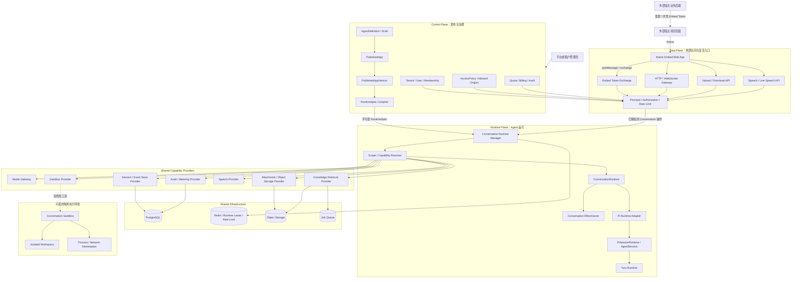
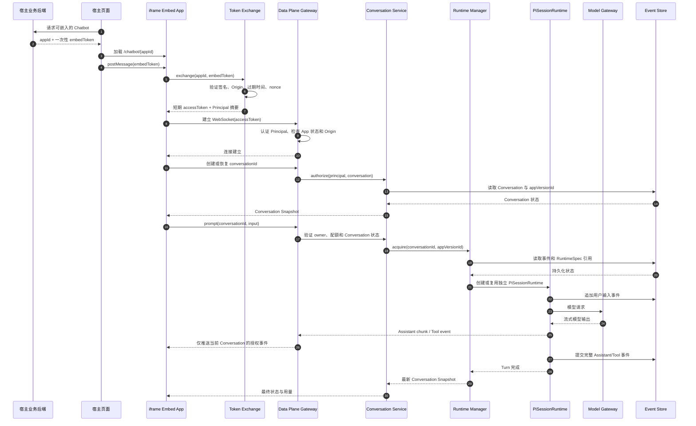
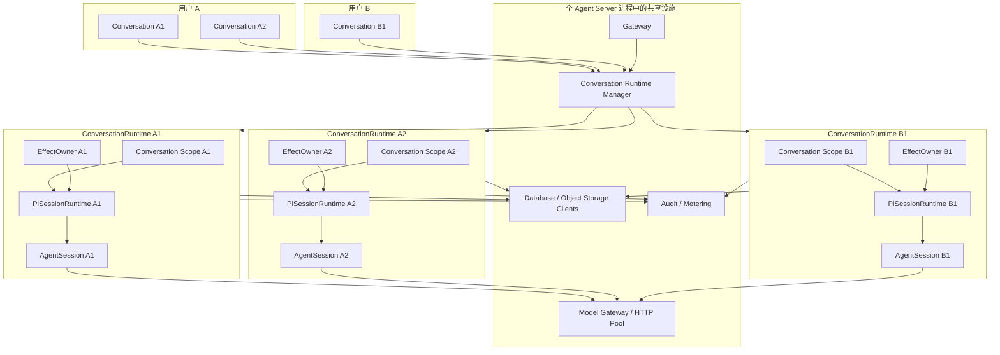
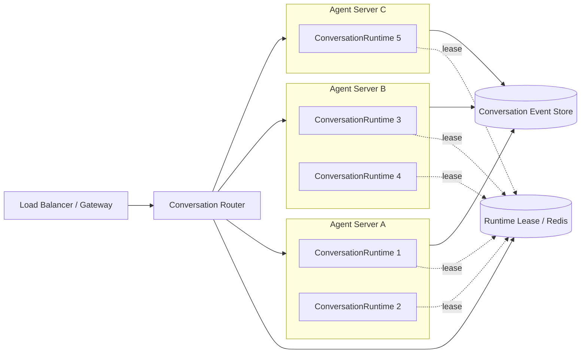
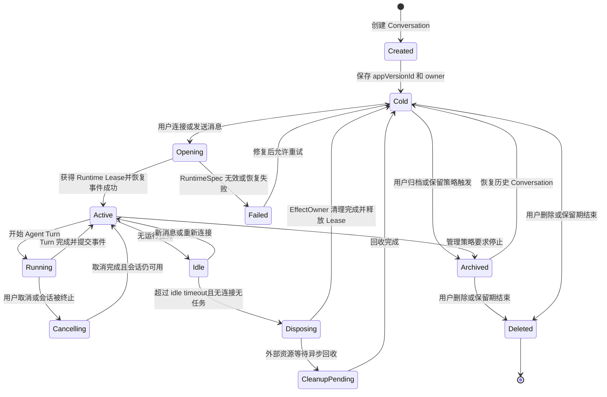
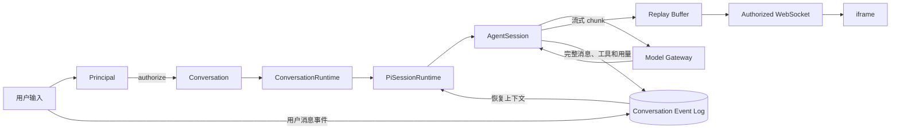

# 多用户发布与网页嵌入——总体架构设计

## 1. 文档目的

本文用于设计 SKDY Agent 从单用户应用演进为支持多人访问、iframe 嵌入、用户隔离和上下文管理的平台框架。本文只确定架构边界、核心概念和设计不变量，不进入编码、数据库建表或接口实现。

本文同时分析 `/home/hello/workspace/deepseek-harness` 中可借鉴的设计。结论是：DeepSeek Harness 能为运行时作用域、能力组合、生命周期和会话重建提供参考，但没有现成解决多租户认证、iframe 发布、资源授权、配额计费和 SaaS 控制面问题。

## 2. 当前判断

当前项目已经具备多会话、流式协议、附件、引用、语音和 Web 对话等基础，但整体仍接近“单实例、本地可信用户”模型。

现有多会话能力不等于多用户安全隔离，主要缺口包括：

- 当前 Bearer Token 更接近部署级共享密钥，没有完整用户身份和资源授权语义。
- 会话、附件和引用主要按 `sessionId` 关联，没有完整的 `tenantId + appId + userId` 所有权链。
- Bash、文件系统和 `cwd` 仍可能共享宿主执行环境。
- 缺少 PublishedApp、不可变发布版本、访问策略、下线和回滚模型。
- 缺少 iframe Token 交换、Origin、CSP 和 `postMessage` 安全协议。
- 进程内 Live Session 状态尚未解决生产环境多节点路由、配额和故障恢复。

目标不是直接把当前页面放进 iframe，而是建立一条完整的发布和隔离链路：

```text
发布 Agent
→ 生成 PublishedApp 和不可变版本
→ iframe 加载公开入口
→ 换取短期访问 Token
→ 建立 Principal
→ 创建或恢复独立 Conversation
→ 解析该会话可见的 Agent 能力
→ 执行 Agent
→ 隔离消息、附件、引用、语音和执行资源
```

## 3. DeepSeek Harness 能解决什么

DeepSeek Harness 的核心价值位于 Runtime Plane：它擅长在同一进程中组合多个 Agent，使不同 Agent 获得不同工具、提示词和服务，并保证动态注册具有明确所有者和清理路径。

它不能直接提供完整的多人发布平台。其开发用 Web Server 明确不负责 TLS、认证和 Origin 策略；其 initiator 上下文也只表达同进程因果归属，不构成授权证明。

因此应将 DeepSeek Harness 视为运行时架构参考，而不是可直接复用的 SaaS 发布后端。

## 4. 值得借鉴的设计

### 4.1 分层 Scope

DeepSeek Harness 的 Scope 同时表示：

- 某项注册对哪个 Agent 可见。
- 某项注册由哪个生命周期所有者负责。

它通过全局层和 Agent 局部层合并工具、技能等能力，使一个进程中的多个 Agent 可以拥有不同能力集合。

多人架构可以借鉴这一思想，建立以下层级：

```text
Platform Scope
  └── Tenant Scope
       └── PublishedAppVersion Scope
            └── Conversation Scope
                 └── Turn Scope
```

各层建议职责如下：

| Scope | 适合承载的内容 |
|---|---|
| Platform | 模型网关、数据库、对象存储、审计、全局安全策略 |
| Tenant | 租户凭据、额度、共享知识库、租户业务工具 |
| PublishedAppVersion | 固定 Prompt、工具集合、模型、主题和发布配置 |
| Conversation | 用户附件、会话记忆、沙箱和临时运行状态 |
| Turn | 单次请求注入、取消信号、调用预算和本轮检索结果 |

Scope 只解决能力可见性、路由和生命周期。用户是否有权进入某个 Scope，必须由独立认证授权层判断。

### 4.2 Agent Preset 与不可变发布版本

DeepSeek Harness 的 Agent Preset 能让不同会话在同一进程中挂载不同工具、Prompt section、persona 和服务实现，同时保持进程级设施共享。

这与我们的 `PublishedAppVersion` 很接近。建议把发布版本视为一份不可变 Runtime Spec：

```text
PublishedApp
  └── PublishedAppVersion
       ├── AgentPresetSnapshot
       ├── ModelConfig
       ├── SystemPrompt
       ├── ToolPolicy
       ├── KnowledgeBinding
       ├── PermissionPolicy
       ├── VoiceConfig
       └── AvatarConfig
```

不建议直接照搬文件形式的 `agent.cordis.yml`。生产 SaaS 更适合把草稿存入数据库，发布时编译为不可变版本快照，由 Runtime 根据快照创建 App 和 Conversation scope。

发布版本应遵循：

- 发布后不可原地修改。
- 新 Conversation 默认绑定当前版本。
- 已存在 Conversation 默认继续绑定创建时版本。
- 回滚通过切换 PublishedApp 的当前版本指针实现。
- 版本删除不能破坏仍有 Conversation 引用的历史配置。

### 4.3 Scoped Registry

DeepSeek Harness 的工具和技能注册表具有全局层和精确作用域层。读取时将公共能力与当前 Agent 的局部能力合并。

该机制可以用于我们的：

- 工具注册。
- Prompt section。
- Skills。
- 知识库 provider。
- 模型路由。
- 审批策略。
- 文件系统 provider。
- Sandbox provider。

示例：

```text
Platform
  search → 公共搜索服务

Tenant A
  crm_query → Tenant A CRM

PublishedApp A v3
  search → 受限企业搜索

Conversation 1001
  attachments → 当前用户上传文件
```

第一阶段不建议开放任意同名覆盖，应规定：

- 平台安全策略不可被下层覆盖。
- 租户只能覆盖平台明确开放的 capability。
- PublishedApp 只能选择白名单中的工具和 provider。
- Conversation 只能增加私有数据源，不能提升权限。

### 4.4 可撤销 Effect 与资源所有权

DeepSeek Harness 把动态注册和资源申请建模为由 Fiber 拥有的 effect，并要求提供 disposer。所有者卸载时按逆序清理。

多人系统可以为以下操作采用相同模型：

```text
注册工具       → disposer 删除工具
注册事件监听器 → disposer 移除监听器
创建临时目录   → disposer 删除临时目录
启动子进程     → disposer 终止进程树
打开数据库句柄 → disposer 关闭句柄
创建 TTS 任务  → disposer 取消任务
挂载知识索引   → disposer 释放引用
```

建议定义四类生命周期所有者：

```text
TenantRuntime
PublishedAppRuntime
ConversationRuntime
TurnRuntime
```

Conversation 被关闭、超时、删除、迁移或运行失败时，应由同一条生命周期路径释放它拥有的全部 effects。不能只依赖各模块自行监听“会话结束”事件并手工清理。

### 4.5 Capability Seam

DeepSeek Harness 将一项能力拆成：

```text
Service Definition
Service Provider
Consumer
```

例如文件能力可表示为：

```text
Filesystem Definition
├── Local Filesystem Provider
├── Container Filesystem Provider
└── Remote Sandbox Filesystem Provider

Consumer
├── read 工具
├── write 工具
└── edit 工具
```

这对多人系统有价值，因为不同租户、套餐或发布应用可能使用不同 provider。

建议优先为确实存在多实现、安全边界或作用域变化的能力建立 seam：

- Identity/Authorization。
- Model Gateway。
- Session Store。
- Attachment Store。
- Knowledge Retrieval。
- Filesystem。
- Subprocess/Shell。
- Sandbox。
- Tool Registry。
- Speech/TTS。
- Audit/Metering。

不应把所有内部函数都改造成 capability。只有存在替换需求和明确消费者的能力才值得抽象。

### 4.6 Event-sourced Session

DeepSeek Harness 将 Session 定义为 append-only event log，模型消息历史从日志推导。用户输入、模型输出、工具调用、工具结果、Prompt、工具 Schema 和模型参数都可以被重建。

多人架构应吸收以下不变量：

> 模型实际看到的 Prompt、工具 Schema、用户输入、检索内容和工具结果，都必须能从 Conversation 的持久化记录重建。

这可以支持：

- 节点故障后的会话恢复。
- 审计某次模型请求的完整输入。
- 发布版本变化后的历史一致性。
- 用户和租户成本统计。
- 断线恢复、重试和迁移。
- 用户数据导出与删除。
- 越权内容来源追踪。

我们不必复制 DeepSeek Harness 的全部事件类型，但需要一个明确的 Conversation 事实源，避免运行时 messages、数据库记录和 Web 快照各自成为不同权威状态。

### 4.7 进程级设施与会话级贡献分离

DeepSeek Harness 的 Preset 设计要求跨 Session 设施作为进程单例留在 Host composition，Preset 只携带单个 Agent 对这些设施的贡献。如果 Preset 尝试发布进程级全局服务，应拒绝挂载。

多人系统也应禁止 PublishedApp 创建或覆盖以下平台设施：

- 数据库连接池。
- 全局模型密钥管理。
- 身份认证服务。
- 全局审计。
- 全局限流。
- Host 文件系统。
- Root Sandbox 管理器。

PublishedApp 只能选择这些设施提供的受限能力，配置 provider 参数，并创建 App 或 Conversation 级资源。

## 5. 只能部分借鉴的设计

### 5.1 Principal 与 Initiator 必须分开

DeepSeek Harness 的 initiator 表示“当前操作由哪个 Agent 发起”，适合内部 tracing、Scope 路由和资源归属，但其文档明确说明 initiator 不是 authorization。

多人系统必须区分：

```text
Principal：经过认证的安全身份及权限
Initiator：当前运行时操作的因果发起者
```

概念结构如下：

```text
RequestContext
├── principal
│    ├── tenantId
│    ├── appId
│    ├── appVersionId
│    ├── userId
│    ├── roles
│    └── scopes
└── initiator
     ├── agentRuntimeId
     ├── conversationRuntimeId
     └── turnId
```

权限判断只能基于 Principal、资源所有权和访问策略，不能用当前 Agent、当前 Scope 或 initiator 代替。

### 5.2 Context Isolation 不是安全沙箱

Context isolation 能隔离工具可见性、Prompt、服务 provider 和生命周期，但同一 Node.js 进程中的代码仍可能绕过 Context，直接访问 `node:fs`、`process.env` 或启动子进程。

因此它不能隔离：

- 不可信代码。
- 宿主文件系统。
- 环境变量。
- 内存和 CPU。
- 网络。
- 进程空间。

公开 Coding Agent 仍需要容器或远程 Sandbox。第一版公开 Chatbot 应默认禁用 Bash、任意文件访问和任意网络工具。

### 5.3 Agent Preset 不等于 PublishedApp

Preset 只解决某个 Session 使用哪套 Agent 组合。PublishedApp 还必须处理：

- 租户所有权。
- 公共 appId。
- 发布审批。
- Origin 白名单。
- 访问策略。
- 用户身份映射。
- 配额与计费。
- 数据保留。
- iframe 展示配置。
- 下线、封禁和回滚。

因此可以把 PublishedAppVersion 编译成类似 Preset 的 Runtime Spec，但不能把 Preset 当作完整发布模型。

## 6. DeepSeek Harness 没有、需要自建的能力

### 6.1 多租户身份和权限

需要自建：

```text
Tenant
User
TenantMembership
Role
Principal
ServiceAccount
PublishedAppAccessPolicy
```

并统一使用：

```text
authorize(principal, action, resource)
```

### 6.2 iframe 发布协议

需要自建：

- Public App 页面。
- Embed Token。
- Token exchange。
- 短期 Access Token。
- Token 刷新和撤销。
- `postMessage` 协议。
- Allowed Origins。
- CSP `frame-ancestors`。
- 匿名用户策略。

### 6.3 发布控制面

需要自建：

- Agent 编辑和草稿。
- PublishedApp。
- PublishedAppVersion。
- 发布、下线和回滚。
- 发布审计。
- App Secret。
- Domain/Origin 配置。
- 品牌、主题、Avatar 和语音配置。

### 6.4 配额、计费和滥用防护

需要自建：

- 用户和租户限流。
- Token 配额及模型成本。
- 上传容量。
- TTS 使用量。
- Sandbox 时长。
- 并发限制。
- 封禁与异常检测。

### 6.5 多节点运行

需要自建：

- Conversation 路由。
- Redis presence。
- Job Queue。
- Sticky Session 或 Runtime ownership。
- 节点故障恢复。
- 分布式锁或单写者模型。
- 对象存储。
- 数据库租户隔离。

## 7. 推荐总体架构

多人能力建议拆成三个平面：

```text
┌─────────────────────────────────────────────┐
│ Control Plane                               │
│ Tenant / User / Agent / PublishedApp        │
│ Version / AccessPolicy / Quota / Audit      │
└──────────────────────┬──────────────────────┘
                       │ 编译不可变 Runtime Spec
                       ▼
┌─────────────────────────────────────────────┐
│ Runtime Plane                               │
│ AppVersion Scope                            │
│   └── Conversation Scope                    │
│        └── Turn Scope                       │
│ Capability resolution / Effect lifecycle    │
└──────────────────────┬──────────────────────┘
                       │ 事件、状态和资源操作
                       ▼
┌─────────────────────────────────────────────┐
│ Data Plane                                  │
│ iframe / WebSocket / Upload / Speech        │
│ Principal / Authorization / Rate Limit      │
└─────────────────────────────────────────────┘
```

### 7.1 Control Plane

Control Plane 负责管理“允许发布什么”：

- Tenant 和用户。
- Agent 定义和草稿。
- PublishedApp 和版本。
- 访问策略与 Origin。
- 配额、计费和审计。
- 发布、下线与回滚。

Control Plane 不直接执行 Agent turn，而是把 PublishedAppVersion 编译为 Runtime Spec。

### 7.2 Runtime Plane

Runtime Plane 负责“如何运行一个已批准的版本”：

- 创建 AppVersion、Conversation 和 Turn scope。
- 解析可见工具、Prompt、知识库和 provider。
- 管理 effect owner 和 disposer。
- 驱动 Pi Agent runtime。
- 将运行事件写入 Conversation 事实日志。
- 在关闭、失败和迁移时释放资源。

DeepSeek Harness 的 Scope、Preset、Scoped Registry、Effect 和 Capability Seam 主要适用于这一层。

### 7.3 Data Plane

Data Plane 负责“最终用户如何安全访问”：

- iframe 页面。
- Token 交换。
- WebSocket。
- 上传和下载。
- 语音与 TTS。
- Principal 建立。
- 逐资源授权。
- 限流和输入校验。

Data Plane 不能因为 Runtime 已经有 Scope 就跳过授权。

## 8. 建议冻结的核心对象

编码前建议先确定以下概念及边界：

```text
Tenant
TenantMember
AgentDefinition
AgentDraft
PublishedApp
PublishedAppVersion
EmbedCredential
Principal
Conversation
ConversationRuntime
RuntimeSpec
CapabilityBinding
ResourceOwner
UsageRecord
AuditEvent
```

关键对象区别如下：

| 对象 | 含义 |
|---|---|
| AgentDefinition | 可持续编辑的 Agent 逻辑定义 |
| AgentDraft | 尚未发布的配置状态 |
| PublishedApp | 稳定的公开应用身份和入口 |
| PublishedAppVersion | 不可变发布快照 |
| Conversation | 持久化用户会话及资源所有权 |
| ConversationRuntime | 当前执行节点上的临时运行实例 |
| RuntimeSpec | 从发布版本编译出的运行配置 |
| CapabilityBinding | 某个作用域使用哪种能力实现 |
| Principal | 当前请求经过认证的安全身份 |
| ResourceOwner | 数据和运行资源的所有权描述 |
| UsageRecord | 模型、工具、上传、语音等资源消耗 |
| AuditEvent | 安全及管理操作记录 |

## 9. 建议冻结的设计不变量

以下不变量比具体字段和接口更重要：

1. 每个请求必须有经过认证的 Principal，匿名请求也必须映射成匿名 Principal。
2. 每个 Conversation 只能属于一个 tenant、app、appVersion 和 user。
3. 每个持久化数据和运行资源都必须有可验证的 ResourceOwner。
4. 浏览器不能自行声明可信的 tenantId、userId 或角色。
5. PublishedAppVersion 发布后不可原地修改。
6. Conversation 默认固定使用创建时的 PublishedAppVersion。
7. App scope 不能注册或覆盖平台级安全服务。
8. Conversation 销毁必须释放它拥有的全部 effects。
9. Scope 可见性不能替代 authorization。
10. Initiator 只能用于因果归属，不能作为权限证明。
11. 模型可见内容必须能从持久化事件重建。
12. 高风险工具必须通过 Sandbox capability，不能直接访问 Host。
13. 配额必须在实际消耗资源的入口执行，不能只在 UI 或 Prompt 层限制。
14. 外部用户 ID 只能在 tenant 范围内解释和保持唯一。
15. iframe appId 是公开标识符，不是访问凭据。
16. Runtime 实例丢失不能导致持久化 Conversation 损坏。
17. 下层作用域只能收窄平台安全策略，不能扩大权限。
18. App 下线后必须能阻止新访问，并明确已有 Conversation 的处理策略。
19. 发布版本回滚不能改变已经提交的历史会话事实。
20. 所有跨进程、持久化和网络边界都必须显式携带身份与资源归属，不能依赖进程内 ambient context。

## 10. 推荐取舍

建议借鉴 DeepSeek Harness 的五项核心思想：

1. Scope 分层。
2. PublishedAppVersion 编译成 Agent Preset/Runtime Spec。
3. 所有动态贡献具有 effect owner 和 disposer。
4. 关键能力按 Definition、Provider 和 Consumer 分离。
5. Session 使用可重建的事件日志。

当前不建议引入：

- 完整 Cordis 插件树。
- “Everything is a plugin”。
- 运行时由模型生成并挂载任意代码。
- PublishedApp 自定义进程级服务。
- 仅依赖 Context 的安全隔离。
- 为了理论统一而重写 Pi Agent loop。

推荐总体方向是：

> 保留 Pi 作为 Agent 执行核心，在外层建立多租户 Control Plane 和 iframe Data Plane；在 Pi Runtime Adapter 内引入 DeepSeek Harness 风格的 Scope、Runtime Spec、Capability Binding 和 Effect Lifecycle。

## 11. 后续需要继续讨论的问题

本文暂不做决定的问题包括：

- 一个 Conversation 是否始终固定发布版本，还是允许显式迁移。
- 匿名用户如何识别，以及是否允许跨设备恢复历史。
- Tenant、PublishedApp 和用户三层配额如何叠加。
- 第一版是否完全禁用 Bash、文件写入和任意网络访问。
- 知识库是绑定 Tenant、PublishedAppVersion 还是两者都支持。
- AppVersion scope 是每个版本共享一个 standing runtime，还是按 Conversation 复制。
- Conversation Runtime 使用单节点粘性路由还是可恢复 Worker。
- Conversation 的单写者和并发消息排队规则。
- App 下线后已有会话是否只读、继续运行或立即终止。
- 用户删除、租户删除和数据保留策略。
- 语音、附件和 Sandbox 的成本如何计量。
- Control Plane 与现有 Pi Server 是同一服务还是独立部署。

这些问题适合在数据模型和接口设计之前逐项形成决策记录。

## 12. 底座选型与工作量比较

### 12.1 结论

从当前实际项目出发，在现有 Pi 项目上实现对外发布、多人使用和 iframe 嵌入，工作量明显小于迁移到 DeepSeek Harness 后重新实现。

第一版产品的相对工作量可粗略判断为：

| 方案 | 相对工作量 | 风险 |
|---|---:|---|
| 基于现有 Pi 项目改造 | 1× | 中等，主要是多租户和安全改造 |
| 基于 DeepSeek Harness 重建 | 2～3× | 较高，包含迁移、重做和产品能力补齐 |
| 保留 Pi，在外层建设多人平台并局部借鉴 DSH | 1.2～1.4× | 中等，长期结构更清晰 |

推荐第三种方案：保留 Pi 核心和现有产品能力，在外围建设发布平台，并选择性引入 DeepSeek Harness 的 Scope、Capability、Effect Lifecycle 和事件重建思想。

上述数字是架构层面的相对估算，不是精确人日。正式排期前仍需冻结 MVP 范围并进行模块级估算。

### 12.2 现有 Pi 项目可复用的能力

当前项目已经具备发布产品中成本较高的一批用户能力：

- Web 对话页面。
- Pi Agent 执行。
- 多会话基础。
- WebSocket 流式协议。
- 客户端断线恢复。
- 文件上传。
- 文档切块、检索和引用。
- TTS 和实时语音。
- Avatar 与 Rive 渲染。
- Web Component、Embed SDK 和 React 适配经验。
- 服务端 Session Manager。
- WebSocket/HTTP Bearer 校验。
- Origin/CORS 基础。
- 前后端协议和自动化测试。

多人发布主要需要在现有链路上增加身份、所有权和发布模型：

```text
现有 Session
→ 增加 tenant/app/version/user 所有权
→ 每次资源访问执行授权
→ 增加 PublishedApp 和不可变版本
→ 增加 iframe Token 交换
→ 增加配额、审计和生产持久化
```

Agent、Web、语音、上传、检索和 Avatar 都可以继续使用。

### 12.3 DeepSeek Harness 仍需补齐的能力

DeepSeek Harness 的运行时组合能力较强，但它不是现成的多人发布平台。即使选择 DSH，仍需自行建设：

- Tenant、User 和 Membership。
- PublishedApp 和发布版本。
- iframe 页面和嵌入协议。
- Embed Token 交换。
- Principal 与逐资源授权。
- Origin 和 CSP 安全。
- 用户会话归属。
- 上传与知识库租户隔离。
- 配额、限流和计费。
- 管理后台。
- 多节点会话路由。
- 用户数据删除、审计和生产级 Web 鉴权。

这些是多人 SaaS 的主体工作，不会因为底层使用 Cordis 或 DeepSeek Harness 而自动消失。

### 12.4 迁移到 DeepSeek Harness 的额外成本

在完成多人平台能力之外，切换底座还会引入迁移工作：

- 将当前 Pi 会话协议迁移或适配为 DSH SessionEvent 模型。
- 重写或适配现有 WebSocket 客户端。
- 迁移文件上传和引用检索。
- 迁移语音及实时语音协调。
- 迁移 Web UI 会话控制。
- 重新接入 Avatar 状态桥接。
- 重新实现并验证断线恢复和事件回放。
- 将现有工具改造成 capability/provider/consumer。
- 处理已有 Pi 会话数据兼容。
- 重新验证全部端到端行为。
- 建立团队对 Cordis、Fiber、Scope 和 Loader 的共同理解。

DeepSeek Harness 可以减少未来动态组合工具和服务的架构工作，但不会减少当前多人发布控制面和数据面的主体建设工作。

### 12.5 分模块比较

| 工作项 | 现有 Pi | DeepSeek Harness |
|---|---|---|
| PublishedApp | 新增 | 新增 |
| 多租户身份 | 新增 | 新增 |
| iframe Token | 新增 | 新增 |
| 资源授权 | 改造现有链路 | 新增并接入所有链路 |
| Web 对话 | 已有，改造发布入口 | 重新适配产品页面 |
| 会话流式与断线恢复 | 已有 | 迁移并重新验证 |
| 文件上传和引用检索 | 已有，补充所有权 | 迁移或重做 |
| 语音和 Avatar | 已有，补充授权与配额 | 迁移或重新接入 |
| Agent Scope | 需要适量新增 | 原生较强 |
| Effect 生命周期 | 需要新增 | 原生具备 |
| 能力动态组合 | 当前较弱 | 原生较强 |
| 多节点部署和管理后台 | 需要建设 | 同样需要建设 |

### 12.6 不同产品目标下的选择

#### 普通聊天机器人发布

如果目标是通过 iframe 提供多人聊天、文件上传、知识库问答和引用、语音、Avatar 及历史会话，应继续使用现有 Pi 项目。DeepSeek Harness 在该场景中没有足以抵消迁移成本的直接产品收益。

#### 公开 Coding Agent

如果还要公开 Bash、文件编辑、项目工作区、长任务和用户自定义工具，则需要额外建设每个 Conversation 独立 Sandbox、Filesystem 和 Subprocess Provider、工具权限模板、Workspace 生命周期、沙箱配额回收和用户自定义能力隔离。

该场景中 DSH 的 Capability、Scope 和 Effect 模型更有参考价值，但从当前项目整体迁移仍然不划算，可以在 Pi Runtime Adapter 中吸收这些机制。

#### 自演化 Agent 平台

只有当产品目标明确包括 Agent 动态修改工具、每会话挂载插件、运行时局部热替换、多种 Agent loop、动态 Provider 或模型生成新组件时，DeepSeek Harness 才可能成为更合适的长期底座。这已经超出当前 iframe 发布和多人访问的需求。

### 12.7 推荐落地形态

```text
多人发布平台
├── Control Plane
│   ├── Tenant / User
│   ├── PublishedApp / Version
│   └── AccessPolicy / Quota / Audit
├── Data Plane
│   ├── iframe / Token exchange
│   └── WebSocket / Upload / Speech
└── Pi Runtime Adapter
    ├── Pi Agent
    ├── Conversation Runtime
    ├── Scoped Capabilities
    ├── Effect Lifecycle
    └── Session Event Persistence
```

其中只吸收 DeepSeek Harness 的关键运行时机制：

1. AppVersion、Conversation 和 Turn 分层 Scope。
2. 所有运行资源具有 owner 和 disposer。
3. 关键能力通过 Provider 绑定，不直接访问宿主资源。
4. 模型可见上下文可以从会话事件重建。

当前不迁移 Pi Agent loop、WebSocket 协议、Web 前端、文件上传、引用检索、语音、Avatar 和 Pi 模型生态。

### 12.8 最终选型判断

如果需求边界保持为“发布给多人使用并支持 iframe”，预计现有项目可以复用约 70%～80% 的产品链路；迁移到 DeepSeek Harness 后，可能只有约 20%～35% 的产品代码能直接复用，其余需要适配或重建。

> DeepSeek Harness 作为 Runtime Plane 的设计参考，不作为本次多人发布改造的替代底座。除非产品方向明确转向动态插件化、自演化和多 Agent 运行平台，否则不切换现有 Pi 底座。

## 13. 四项借鉴机制的当前实现基础

### 13.1 总体判断

Scope、EffectOwner、Capability Provider 和 RuntimeSpec 并非全部没有实现，而是处于不同成熟度：

| 机制 | 当前状态 | 判断 |
|---|---|---|
| Scope | 有 Session 级雏形 | 已做一部分，但缺少层级化能力作用域 |
| EffectOwner | 有局部 dispose | 已做一部分，但清理机制分散 |
| Capability Provider | 已有多个接口边界 | 基础较好，但多数是进程级注入 |
| RuntimeSpec | 只有分散的运行参数 | 基本需要新增，尤其用于不可变发布版本 |

合理方向不是重新开发一套 Runtime。最需要从零设计的是 RuntimeSpec；最适合渐进重构的是 Scope、EffectOwner 和 Capability Provider。

### 13.2 Scope：已有 Session 隔离，缺少分层能力作用域

当前服务端已经以 Session 作为运行边界。每个 LiveSession 拥有独立的 PiSessionRuntime、AgentSession、消息历史、流式事件日志、当前 Turn、引用结果、连接集合、模型和运行状态。CodingAgentPiSessionRuntime 也明确将一份 Runtime 对应到一个 AgentSession 生命周期。因此当前不是所有会话共享同一个 Agent 状态，Session 之间已经具备一定的运行状态隔离。

现有作用域基本只有：

```text
Server
└── Session
```

多人发布需要：

```text
Platform
└── Tenant
     └── PublishedAppVersion
          └── Conversation
               └── Turn
```

当前缺少 Tenant Scope、Principal/User Scope、PublishedAppVersion Scope、Conversation Capability Scope、Turn Scope、Scope 继承和能力合并规则，也无法原生表达不同 App 的独立工具与 Prompt、同一 App 的多个发布版本，以及下层 Scope 只能收窄权限的约束。

当前 sessionId 主要是状态分组键，还不是完整的能力和安全作用域。后续不需要推翻 LiveSession，可以让它成为 Conversation Scope 的运行容器，并在外层补充 Platform、Tenant 和 AppVersion 层。

### 13.3 EffectOwner：已有清理动作，缺少统一所有权模型

项目已经包含 PiSessionRuntime.dispose、AgentSession.dispose、事件 unsubscribe、LiveSession dispose、Live Speech Job abort、Extension session_shutdown、Provider unregister 和 UI Component dispose。Session 释放路径也会终止语音任务、取消 Runtime 事件订阅并释放 AgentSession。

但清理逻辑分散在不同模块：

```text
LiveSessionManager → 清理 Runtime
LiveSpeechManager  → 清理语音 Job
AgentSession       → 清理 Subscription
Extension          → 响应 session_shutdown
UI                 → 清理 Component
Provider           → 自行 unregister
```

目前没有统一对象表达“这个资源属于 Conversation 1001”，也没有统一的资源注册、逆序释放、异步等待和失败回滚机制。这可能导致新功能忘记接入 Session dispose、初始化中途失败无法回滚、重复清理、顺序依赖和资源泄漏。

后续可以在现有 PiSessionRuntime 和 AgentSession 生命周期外增加 Conversation EffectOwner，把原有 dispose 作为其中一项 effect，而不替换现有内部清理。

### 13.4 Capability Provider：已有接口边界，缺少按 Scope 解析

项目已经存在 PiSessionBackend、PiSessionRuntime、AttachmentStore、CitationService、SpeechManager、LiveSpeechManager、Model Provider、Model Registry、Credential Store、WebSocket Listener 和 HTTP Request Handler。

例如 PiServer 可以注入 AttachmentStore、CitationService、SpeechManager 和 LiveSpeechManager；PiSessionBackend 也已经把服务端和具体 Coding Agent Runtime 分开。这已经接近：

```text
PiServer 消费 Session Capability
CodingAgentBackend 提供具体实现
```

但现有 Provider 多数在服务器启动时创建一次：

```text
PiServer
├── 一个 AttachmentStore
├── 一个 CitationService
├── 一个 SpeechManager
└── 一个 LiveSpeechManager
```

它们还不能根据 tenantId、appVersionId 和 conversationId 动态解析。当前也缺少统一 Capability Definition、Provider ID 和版本、Provider 适用 Scope、Tenant 专属 Provider、Conversation Sandbox Provider、配置校验、生命周期归属和 Provider 变化协调。

不需要重新设计所有服务。应优先把 Session Store、Attachment Store、Knowledge Retrieval、Model Gateway、Filesystem、Sandbox 和 Speech 纳入 Capability Binding。

### 13.5 RuntimeSpec：配置存在但分散，统一模型尚未建立

现有 Session 和 Agent 创建过程已经维护 id、cwd、name、model、thinkingLevel、systemPrompt、tools、scopedModels、extensions 和 settings，这些内容共同构成了事实上的运行配置。

但它们分散在 CLI 参数、Settings、AgentSession 构造参数、Extension Loader、Model Registry、Server options、语音配置和 Web 配置中。当前没有一份不可变对象完整表达一个 PublishedAppVersion 创建 Conversation 时应使用哪些模型、工具、Prompt、知识库、安全策略和资源限制。

目标 RuntimeSpec 可概念化为：

```text
RuntimeSpec
├── appVersionId
├── agent
│   ├── systemPrompt
│   ├── modelPolicy
│   ├── thinkingPolicy
│   └── contextPolicy
├── capabilities
│   ├── tools
│   ├── knowledge
│   ├── attachments
│   ├── speech
│   ├── filesystem
│   └── sandbox
├── security
│   ├── permissionPolicy
│   ├── networkPolicy
│   └── uploadPolicy
├── limits
│   ├── tokenBudget
│   ├── concurrency
│   └── toolTimeout
└── presentation
    ├── theme
    ├── avatar
    └── welcomeMessage
```

当前尚未建立 PublishedAppVersion、RuntimeSpec 编译与校验、Conversation 对 RuntimeSpec 的固定引用、从 RuntimeSpec 创建 Session Runtime，以及恢复会话时按原 RuntimeSpec 重建能力。RuntimeSpec 是四项机制中最需要从零设计的部分。

### 13.6 四项机制的组合关系

```text
PublishedAppVersion
        │
        ▼
编译 RuntimeSpec
        │
        ▼
创建 Conversation Scope
        │
        ├── 解析 Capability Providers
        │
        └── 创建 EffectOwner
                │
                ├── PiSessionRuntime
                ├── Tool registrations
                ├── Speech jobs
                ├── Attachment handles
                └── Sandbox
```

Conversation 结束时：

```text
EffectOwner.dispose()
→ 取消 Turn
→ 终止语音和工具任务
→ 释放 Sandbox
→ 注销监听器
→ dispose PiSessionRuntime
```

### 13.7 现有模块的后续定位

| 现有模块 | 后续定位 |
|---|---|
| LiveSession | 演进为 ConversationRuntime 的运行容器 |
| PiSessionRuntime | 继续作为 Pi Agent Adapter |
| PiSessionBackend | 继续作为 Session Runtime Provider |
| runtime.dispose | 纳入 Conversation EffectOwner |
| AttachmentStore | 演进为带 ResourceOwner 的 Attachment Capability |
| CitationService | 演进为 Knowledge Retrieval Capability |
| SpeechManager | 演进为可计量、可授权的 Speech Capability |
| LiveSpeechManager | 归属于 Conversation/Connection effects |
| Model Registry | 演进为受 RuntimeSpec 约束的 Model Capability |
| Session options | 从 RuntimeSpec 派生 |
| sessionId | 保留，但不能代替 tenant/app/user 所有权 |

### 13.8 推荐演进顺序

1. 先定义 PublishedAppVersion 到 RuntimeSpec 的编译关系。
2. 让现有 LiveSession 承载 Conversation Scope。
3. 把已有 dispose 行为收拢进统一 EffectOwner。
4. 将 Backend、Store、Speech 和 Retrieval 接口接入 Capability Binding。
5. 增加 Tenant、User、Principal、ResourceOwner 和逐资源授权。

这一顺序保留现有 Pi Agent、WebSocket、上传、引用、语音和 Avatar 能力，不重新开发 Runtime。

## 14. 多人发布架构图

本章图示基于前述推荐方案：保留 Pi Agent 作为执行核心，在其外层建设 Control Plane 和 Data Plane，并在 Pi Runtime Adapter 中逐步引入 Scope、EffectOwner、Capability Binding 和持久化事件重建。

### 14.1 系统总体架构



架构边界说明：

- Control Plane 决定允许发布什么，并把不可变 PublishedAppVersion 编译成 RuntimeSpec。
- Data Plane 负责 iframe、Token、网络协议、Principal、授权和限流。
- Runtime Plane 只执行已经授权并完成解析的 RuntimeSpec。
- Pi Runtime 继续负责模型与工具循环，不承担 Tenant、发布和 iframe 鉴权。
- Scope 负责能力可见性，Authorization 负责安全权限，两者不能互相替代。
- 普通聊天和知识库能力可以共享 Provider；Bash、文件写入和子进程必须进入 Conversation Sandbox。

### 14.2 iframe 鉴权与对话请求时序



关键约束：

- appId 是公开标识符，不是访问凭据。
- externalUserId 只能来自宿主后端签发的 Token，不能信任 iframe URL 参数。
- Data Plane 先建立 Principal，再允许访问 Conversation。
- 外部协议只暴露 conversationId，不暴露 Pi 内部 runtimeSessionId。
- 实时 chunk 走 WebSocket，最终消息和模型可见输入进入持久化事件。
- 每次资源操作都重新检查 Principal 与 ResourceOwner，不只在 iframe 加载时鉴权一次。

### 14.3 多用户 Runtime 拓扑



运行实例规则：

- 多个用户共享 Pi 代码、Agent Server、模型连接池和无用户状态的基础设施。
- 每个活跃 Conversation 拥有独立 PiSessionRuntime 和 AgentSession。
- Runtime 数量按活跃 Conversation 计算，不按 User 计算。
- 一个用户打开多个 Conversation 时，可以同时拥有多个 Runtime。
- 同一个 Conversation 同时最多有一个 Runtime owner 和一个主 Agent Turn。
- 不同 Conversation 可以并行执行，但受平台、租户、应用和用户四级并发限制。
- 普通聊天不要求每个 Conversation 创建进程；危险工具才需要独立 Sandbox。

多节点扩容后，拓扑变为：



同一个 Conversation 在同一时刻只能由一个节点持有有效 Lease。节点失效后，其他节点从持久化事件和原 RuntimeSpec 重建 ConversationRuntime。

### 14.4 Conversation 与 Runtime 生命周期

Conversation 是长期持久化产品对象；ConversationRuntime 是按需创建的临时执行实例。两者不能混为同一对象。



生命周期说明：

- Cold 状态只有数据库记录和事件日志，不持有 AgentSession。
- Opening 根据 PublishedAppVersion 解析 RuntimeSpec，并恢复 PiSessionRuntime。
- Running 状态执行一个主 Turn；后续输入进入 Steering 或 Follow-up Queue。
- Idle 可以短暂保留 Runtime，避免频繁重建。
- Disposing 通过 EffectOwner 依次取消任务、终止语音、释放 Sandbox、注销监听器并释放 PiSessionRuntime。
- 节点崩溃时 disposer 可能无法执行，因此外部资源仍需 Lease、超时和幂等回收。
- Deleted 是产品数据生命周期；Runtime dispose 只是释放内存和外部运行资源，不能等同于删除 Conversation 数据。

### 14.5 输入、输出和上下文归属图



输入输出管理原则：

1. 所有用户使用同一套 Pi runtime 代码，但不共享 AgentSession。
2. 每个活跃 Conversation 对应零或一个 ConversationRuntime。
3. 每个 ConversationRuntime 对应一个 PiSessionRuntime 和一个 AgentSession。
4. 输入先经过 Principal 授权，再进入对应 Conversation 的单写者队列。
5. 流式输出只推送给已授权且订阅该 Conversation 的连接。
6. 最终输出、工具调用、引用、Prompt 版本和用量进入持久化事件。
7. Runtime 被释放后，可以从事件日志和 RuntimeSpec 重建，不依赖旧进程内对象。

## 15. 容量规划与软硬件资源估算

本节给出架构设计阶段的保守估算，用于一期资源选型和压测目标定义，不代表当前代码已经实测达到这些数字。容量不能只用“用户数”描述，至少要区分：

| 口径 | 含义 | 主要资源 |
|---|---|---|
| 注册用户数 | 已创建身份但不一定在线 | 数据库、存储 |
| 在线用户数 | iframe 页面保持连接 | WebSocket、少量内存 |
| 活跃用户数 | 正在输入或接收回复 | ConversationRuntime、模型 API |
| 同时生成数 | LLM 或 TTS 正在生成 | 模型配额、GPU，是主要瓶颈 |

### 15.1 文本聊天单机估算

假设 LLM 使用外部 API、不在本机部署大模型、普通问答不执行高负载代码、一次回复约 10～30 秒：

| 应用节点 | 在线连接数 | 同时活跃对话 | 粗略日活范围 |
|---|---:|---:|---:|
| 4 核 / 8 GB | 300～1,000 | 10～25 | 100～300 |
| 8 核 / 16 GB | 1,000～3,000 | 20～50 | 300～1,000 |
| 16 核 / 32 GB | 3,000～8,000 | 50～150 | 1,000～5,000 |

一期建议把验收目标定为：8 核 16 GB 应用节点，支持 1,000 个 iframe 在线连接和 30 个同时运行的文本 Agent Turn。最终数值必须通过连接、生成和混合负载压测确认。

同时生成数可以用下式估算：

```text
同时生成数 ≈ 峰值请求数/分钟 × 平均生成秒数 ÷ 60
```

例如每分钟 30 个请求、平均运行 20 秒，大约有 10 个同时生成任务。此时外部 LLM 的并发数、Token/minute 和请求速率配额可能比 Node/Pi Server 更早成为瓶颈。

### 15.2 Pi Runtime 内存模型

多人模式不是每个用户启动一个完整 Node.js/Pi 进程，而是一个 Pi Server 管理多个逻辑 ConversationRuntime；每个活跃 Conversation 对应一个 PiSessionRuntime 和 AgentSession。不活跃会话应持久化后卸载，需要时重建。

规划阶段可以暂按以下范围预留：

| 对象 | 暂估内存 |
|---|---:|
| 空闲 WebSocket | 数十 KB～数百 KB |
| 普通活跃 Runtime | 5～30 MB |
| 长上下文/大量工具结果 Runtime | 30～100 MB 或更高 |

这些不是实测数据，需要以 Node heap、RSS 和典型长会话采样修正。必须配套 Runtime 空闲回收、上下文限制、工具结果截断、单会话预算、节点 Runtime 上限和超限排队。当前服务每个会话默认最多保留 2,000 个可重放事件，多人环境还应限制事件总字节数。

### 15.3 语音 GPU 是当前明确瓶颈

当前语音服务使用 `Qwen/Qwen3-TTS-12Hz-1.7B-CustomVoice`，默认 `PI_VOICE_MAX_CONCURRENCY=1`，且流式和非流式共享同一个 GPU 信号量。因此文本可以有几十个并发时，单个语音 Worker 仍只有一个正在生成的任务，其余必须排队。

语音吞吐可按下式估算：

```text
每分钟可启动语音数
≈ GPU 生成并发 × 60 ÷ 平均生成耗时（秒）× 目标利用率
```

若平均 20 秒音频需要生成 10 秒，并发为 1、目标利用率 70%，则约为 4 次/分钟。这只是演算示例，必须在最终 GPU、Attention 实现和真实文本长度上测试 RTF、首包延迟、显存峰值和稳定并发。

一期建议把 TTS 独立部署在 24 GB 显存级 GPU 上，先保持并发 1，并实现任务队列、排队上限、超时、按需生成和结果缓存；不能把“所有回复自动语音化”作为默认策略。

当前约 24 kHz、单声道、Float32 PCM 的原始带宽约为：

```text
24,000 × 4 Byte ≈ 96 KB/s ≈ 0.77 Mbps/播放用户
```

10 个同时播放用户约 7.7 Mbps，100 个约 77 Mbps。后续宜使用更紧凑的音频格式，并让已生成音频走对象存储/CDN。

### 15.4 文件与存储预算

按当前单文件约 25 MiB、一次最多 10 个文件计算，单次/单会话在极端情况下可能产生约 250 MiB 上传量：

| 会话数 | 极端上传量 |
|---:|---:|
| 100 | 25 GB |
| 1,000 | 250 GB |
| 10,000 | 2.5 TB |

真实使用通常远低于极端值，但多人发布前必须增加用户、应用和系统三级配额；临时文件过期清理；对象存储；文件引用计数；以及删除策略。应用节点本地磁盘不应成为长期附件真相源。

### 15.5 Coding 工具的独立容量模型

如果只发布问答、知识库和受控工具，应用节点可承载较多用户。如果允许 Shell、Python/Node、依赖安装、编译测试或后台进程，则每个活跃会话需要独立沙箱：

| 沙箱负载 | CPU | 内存 |
|---|---:|---:|
| 轻量脚本 | 0.5～1 核 | 512 MB～1 GB |
| 普通 Coding Agent | 1～2 核 | 1～4 GB |
| 编译/测试 | 2～4 核 | 4～8 GB |

因此同一台 8 核 16 GB 机器，普通文本 Agent 可把目标定为 20～50 个活跃对话；受控轻量工具约 10～30 个；完整 Coding 沙箱只能粗略按 4～8 个高强度活跃用户规划。RuntimeSpec 应至少分为 `chat-only`、`chat-with-files`、`chat-with-approved-tools` 和 `coding-sandbox`，分别配置资源、并发与超时。

### 15.6 一期资源组合与验收目标

| 组件 | 一期建议 |
|---|---|
| 网关/API/Pi Runtime | 8 核、16 GB |
| PostgreSQL | 2～4 核、8 GB，可优先使用托管服务 |
| Redis | 1～2 GB，用于租约、限流和临时状态 |
| 对象存储 | 初期 100～500 GB，按量扩展 |
| TTS | 独立 24 GB 显存级 GPU，初始生成并发 1 |
| 网络 | 应用节点至少 100 Mbps，语音占比高时提高 |
| 监控 | CPU、RSS/heap、事件循环、Runtime 数、模型延迟、GPU 队列 |

一期容量验收建议：

1. 1,000 个 iframe 在线连接。
2. 30 个同时运行的文本 Agent Turn。
3. 300～1,000 日活作为业务量级参考，而不是技术硬上限。
4. 一个同时生成的 TTS 任务，其余有界排队。
5. Runtime 空闲 10～30 分钟自动卸载。
6. 用户、应用和系统三级资源配额生效。

### 15.7 估算边界

上述资源并不意味着当前代码不改即可达到目标。正式承诺容量前，还需要多租户持久化、Runtime 租约和节点路由、空闲回收、模型并发调度、TTS 队列、对象存储、多节点连接路由、完整指标，以及至少三轮压测：纯连接压测、文本生成压测、语音/工具混合压测。

当前阶段可以采用的结论是：Pi 内核适合承载多用户的逻辑 Runtime；一期可用 8 核 16 GB 把目标定在 1,000 在线连接和 30 个同时活跃文本会话；语音必须按 GPU 生成并发单独计算，Coding 工具必须按隔离沙箱数量单独计算。
