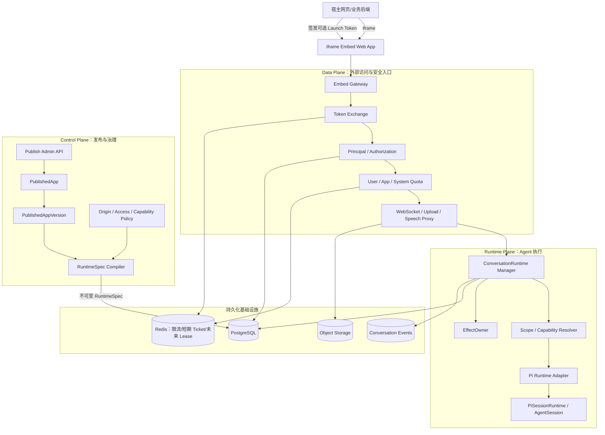
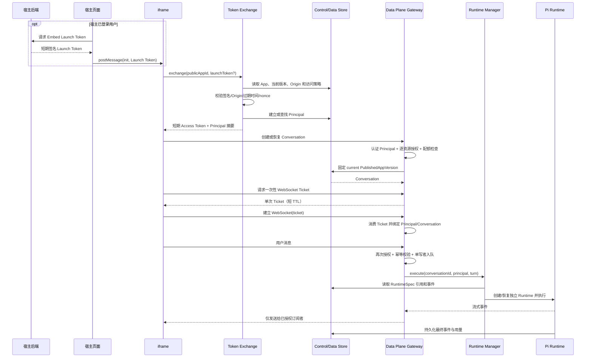
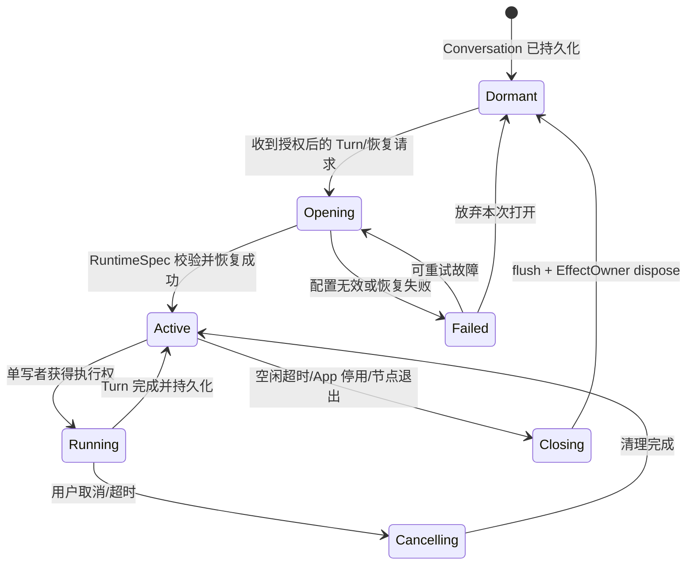
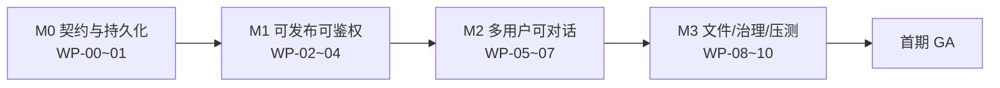

# 多用户发布与网页嵌入——MVP 实施规格

> 状态：Implementation Playbook v1（可按 TASK-000～039 顺序实施）
>
> 设计基线：`docs/ARCHITECTURE-BASELINE.md`、`docs/MULTI-USER-PUBLISHING-ARCHITECTURE.md`
>
> 本文是可执行实施规格，不代表已经开始编码。若本文与框架设计冲突，以框架设计中的核心对象和设计不变量为准；实施前应通过评审消除冲突。

## 1. 目标与交付结果

首个版本要让一个已配置的 Agent 能被发布为稳定的公开应用，并通过如下形式嵌入不同项目：

```html
<iframe
  src="https://agent.example.com/embed/{publicAppId}"
  allow="microphone"
></iframe>
```

交付后必须满足：

1. 管理员可以创建 `PublishedApp`，生成不可猜测但可公开的 `publicAppId`。
2. 管理员可以把当前 Agent 配置发布为不可变的 `PublishedAppVersion`。
3. iframe 可以独立打开，也可以嵌入允许的宿主 Origin。
4. 支持匿名访客和宿主系统已登录用户两种身份模式。
5. 不同 Principal 的会话、消息、附件、引用和流式事件严格隔离。
6. 每个 Conversation 固定绑定创建时的 `PublishedAppVersion`。
7. 活跃 Conversation 按需创建独立 `ConversationRuntime`，不为每个用户启动完整 Pi 进程。
8. Runtime 释放后，Conversation 可以从持久化消息/事件和原 RuntimeSpec 恢复。
9. 首期支持单应用节点运行，并为后续多节点 Lease 保留接口边界。
10. 达到一期容量验收目标：1,000 个在线 iframe 连接、30 个同时运行的文本 Agent Turn。

## 2. 范围

### 2.1 MVP 必须包含

- `PublishedApp` 创建、启用、停用。
- `PublishedAppVersion` 创建、发布、切换当前版本、回滚。
- `PublishedAppVersion -> RuntimeSpec` 编译和校验。
- iframe Embed 页面与响应式聊天 UI。
- 允许 Origin 配置、CSP `frame-ancestors` 和 CORS 校验。
- 匿名 Principal。
- 宿主后端签名的外部用户 Principal。
- 短期 Embed Access Token 和一次性 WebSocket Ticket。
- Conversation 创建、列表、恢复和归档。
- 消息、事件、附件元数据、RuntimeSpec 引用持久化。
- Conversation 逐资源授权。
- 单 Conversation 单写者执行。
- Runtime 按需加载、空闲释放、失败恢复。
- 用户/App/系统三级基础配额和限流。
- 审计日志、指标、结构化日志和基础告警。
- iframe 与宿主页的最小 `postMessage` 协议。
- 文本对话、现有文件上传/引用能力的受控复用。

### 2.2 MVP 明确不包含

- 把 DeepSeek Harness 或 Cordis 替换为执行底座。
- 多节点 Runtime Lease 和跨节点热迁移。
- 计费、套餐和支付。
- Tenant 自定义动态插件或进程级 Provider。
- 完整 Coding Agent 对外开放。
- 每用户独立容器/虚拟机沙箱。
- 自定义域名。
- Embed JavaScript SDK；一期只定义未来 SDK 可复用的协议。
- SEO 或公开会话分享。
- 跨 PublishedApp 共享对话历史。
- 自动把所有回复转换为语音。

### 2.3 条件性能力

语音和 Avatar 不阻塞文本 MVP：

- Avatar 保持客户端能力，通过发布配置决定是否展示。
- TTS 只能按需触发，进入有界队列；默认 GPU 生成并发为 1。
- 实时语音应在文本 MVP 的身份、授权和配额链路稳定后接入。

## 3. 冻结的架构决策

| 编号 | 决策 |
|---|---|
| AD-01 | 保留 Pi Agent/PiSessionRuntime 作为 Agent 执行核心。 |
| AD-02 | 在 Pi 外建设 Control Plane 和 Data Plane，不把 Tenant、发布与 iframe 鉴权塞进 Pi 内核。 |
| AD-03 | `PublishedAppVersion` 发布后不可原地修改。修改配置必须生成新版本。 |
| AD-04 | 每个 Conversation 固定引用创建时版本；发布新版本不悄悄改变已有会话。 |
| AD-05 | `RuntimeSpec` 是发布版本编译出的不可变运行配置。 |
| AD-06 | `Conversation` 是持久对象；`ConversationRuntime` 是按需创建、可释放的临时对象。 |
| AD-07 | 一个 Pi Server 进程承载多个逻辑 Runtime；每个活跃 Conversation 拥有独立 PiSessionRuntime/AgentSession。 |
| AD-08 | 所有资源访问先认证 Principal，再按 ResourceOwner 授权。Scope 不能替代授权。 |
| AD-09 | 匿名身份也必须映射为 Principal，不能使用空用户或共享默认用户。 |
| AD-10 | `publicAppId` 是公开定位符，不是凭据。 |
| AD-11 | 外部用户标识只能来自宿主后端签发的 Launch Token，不能信任 URL 参数或普通 `postMessage` 字段。 |
| AD-12 | iframe Access Token 短期有效；WebSocket 使用更短期、单次消费的 Ticket。 |
| AD-13 | 首期单节点实现 Runtime Owner 接口；接口不得依赖“永远只有一个节点”的假设。 |
| AD-14 | App/Version 只能引用平台白名单中的模型、工具、知识库和 Capability Provider。 |
| AD-15 | 下层 Scope 只能继承或收窄权限，不能扩大上层权限。 |

## 4. 系统架构图

需要架构图。以下图不是另起设计，而是把框架设计文档的三平面收敛到 MVP 实施边界。



实现约束：

- Control Plane 决定“允许发布什么”。
- Data Plane 决定“谁可以访问什么”。
- Runtime Plane 只执行已经授权并解析完成的 RuntimeSpec。
- Pi 不直接处理 iframe 身份、Tenant 权限或发布版本管理。

## 5. 核心领域对象

### 5.1 对象与职责

| 对象 | 职责 | 生命周期 |
|---|---|---|
| Tenant | 资源和配额顶层边界 | 长期 |
| User | 平台管理端用户 | 长期 |
| AgentDefinition | 可编辑的 Agent 草稿 | 可变 |
| PublishedApp | 稳定公开身份、入口和策略容器 | 长期 |
| PublishedAppVersion | 一次不可变发布快照 | 不可变 |
| RuntimeSpec | 从版本编译出的执行配置 | 不可变 |
| Principal | 当前请求的安全身份 | Token 生命周期 |
| Conversation | 最终用户长期会话 | 持久化 |
| ConversationEvent | 输入、输出、工具、状态和用量事实 | 追加写 |
| ConversationRuntime | 当前节点上的执行实例 | 临时 |
| ResourceOwner | 资源归属 `(tenantId, appId, principalSubject)` | 随资源 |
| EmbedLaunchKey | 宿主后端签发 Launch Token 的密钥材料 | 可轮换 |

### 5.2 Principal 类型

```text
Principal
├── platform_user       管理端用户
├── external_user       宿主系统已认证用户
├── anonymous_visitor   浏览器匿名访客
└── service             内部服务身份
```

Principal 至少包含：

```text
principalId
principalType
subject
 tenantId
publishedAppId
externalUserId?     // 仅 external_user
anonymousVisitorId? // 仅 anonymous_visitor
issuedAt
expiresAt
scopes[]
```

`externalUserId` 必须被限定在 `(tenantId, publishedAppId)` 命名空间内，不能作为全平台直接主键。

### 5.3 PublishedAppVersion 快照

发布版本至少冻结：

- Agent prompt/system prompt。
- 模型 Provider、模型 ID 和允许参数。
- 工具白名单及工具配置。
- 知识库快照或固定引用。
- 文件上传策略。
- 语音/Avatar 配置。
- 主题和欢迎语。
- 上下文策略。
- 安全策略版本。
- 配额模板。
- RuntimeSpec schemaVersion。

### 5.4 RuntimeSpec 最小结构

```json
{
  "schemaVersion": 1,
  "publishedAppVersionId": "pav_xxx",
  "agent": {
    "systemPrompt": "...",
    "model": { "provider": "...", "modelId": "...", "params": {} }
  },
  "capabilities": {
    "tools": [],
    "knowledgeBases": [],
    "uploads": { "enabled": true, "maxFiles": 10, "maxFileBytes": 26214400 },
    "speech": { "enabled": false },
    "avatar": { "enabled": false }
  },
  "contextPolicy": {
    "maxTurns": 100,
    "maxContextTokens": 100000,
    "toolResultMaxBytes": 65536
  },
  "runtimePolicy": {
    "profile": "chat-with-files",
    "turnTimeoutMs": 120000,
    "idleTtlMs": 1200000,
    "maxConcurrentTurnsPerConversation": 1
  },
  "securityPolicyVersion": "sp_001"
}
```

编译器必须拒绝未知 schemaVersion、未批准 Provider、不可用模型、越权工具、无效知识库引用和超平台上限的配额。

### 5.5 平台硬上限（TASK-009 冻结）

RuntimeSpec 校验（Schema 层）与编译（Compiler 层）共用以下平台硬上限。数值锚定 5.4 最小结构示例与 PD-08/PD-09/PD-13/PD-14；Schema 拒绝任何越界值（不静默钳制，便于审计）。schemaVersion 从 1 开始，仅接受 `1`，未知版本直接拒绝。

| 路径 | 上限 | 依据 |
| --- | --- | --- |
| `capabilities.uploads.maxFiles` | `<= 10` | PD-09 |
| `capabilities.uploads.maxFileBytes` | `<= 26214400`（25 MiB） | PD-09 |
| `capabilities.tools.length` | `<= 32` | 平台工具白名单规模 |
| `capabilities.knowledgeBases.length` | `<= 8` | MVP 知识库引用规模 |
| `contextPolicy.maxTurns` | `1..100` | 5.4 示例 |
| `contextPolicy.maxContextTokens` | `1..100000` | 5.4 示例 |
| `contextPolicy.toolResultMaxBytes` | `1..65536` | 5.4 示例 |
| `runtimePolicy.turnTimeoutMs` | `1..120000` | 5.4 示例 |
| `runtimePolicy.idleTtlMs` | `<= 1200000`（默认 20 分钟） | PD-14 |
| `runtimePolicy.maxConcurrentTurnsPerConversation` | `== 1` | PD-13 |
| `agent.systemPrompt` 长度 | `<= 65536` 字符 | 单条 prompt 文本上限 |
| `securityPolicyVersion` | 仅接受 `"sp_001"` | MVP 单一安全策略版本 |

以下字段规格未给出具体上限，Schema 仅校验类型与正整数语义，具体平台上限留待安全验收任务冻结：`agent.model.params` 深度与条目数、`capabilities.speech`/`avatar` 内部字段、`contextPolicy` 之外的运行时配额。

Schema 拒绝未知字段（strict 对象，不静默丢弃）。capabilities 只允许 `tools`/`knowledgeBases`/`uploads`/`speech`/`avatar` 五个已知能力键，其余视为越权 capability。

`theme` 是 RuntimeSpec 的可选显示配置扩展（源自 27.1 创建 App 契约，由 Compiler 复制进不可变版本）：`{ primaryColor: "#RRGGBB"?, welcomeMessage?: string }`，不携带任何凭据。

## 6. 数据模型规格

以下是逻辑表，不在本文冻结具体 ORM 或字段类型。

### 6.1 控制面

#### `tenants`

- `id`
- `name`
- `status`
- `created_at`
- `updated_at`

#### `agent_definitions`

- `id`（agent 实体 id，多个 revision 行共享）
- `tenant_id`
- `name`
- `draft_config`
- `revision`（从 1 递增；`(id, revision)` 复合主键，行 = 一个不可变 revision，永不覆盖旧版）
- `source_hash`（33.3 规范化配置的 SHA-256；同 hash 导入幂等，hash 变化才递增 revision）
- `created_by`
- `updated_at`

> 主键为 `(id, revision)` 而非 `id`（TASK-011 修正）：33.3 要求保留每个 revision。因此 `published_apps.agent_definition_id` 不再设外键（复合主键下无法引用单列），跨 tenant agent 归属由 Control Service 在 tenant scope 内解析校验。

#### `published_apps`

- `id`
- `tenant_id`
- `agent_definition_id`
- `public_app_id`，唯一公开定位符
- `name`
- `status`：`draft | active | suspended | archived`
- `current_version_id`
- `access_mode`：`anonymous | signed_user | mixed`
- `allowed_origins`
- `created_by`
- `created_at`
- `updated_at`

#### `published_app_versions`

- `id`
- `published_app_id`
- `version_number`
- `source_agent_revision`
- `snapshot`
- `runtime_spec`
- `runtime_spec_hash`
- `status`：`validating | ready | rejected | retired`
- `created_by`
- `created_at`

唯一约束：`(published_app_id, version_number)`。

#### `embed_launch_keys`

- `id`
- `published_app_id`
- `key_id`
- `public_key` 或加密后的共享密钥引用
- `status`
- `not_before`
- `expires_at`

密钥明文不得进入普通数据库日志和 API 响应。

### 6.2 数据面与会话

#### `principals`

只持久化需要稳定追踪的主体映射：

- `id`
- `tenant_id`
- `published_app_id`
- `type`
- `subject_hash`
- `external_user_id_encrypted?`
- `anonymous_visitor_id_hash?`
- `status`
- `created_at`
- `last_seen_at`

唯一约束：`(tenant_id, published_app_id, type, subject_hash)`。

#### `conversations`

- `id`
- `tenant_id`
- `published_app_id`
- `published_app_version_id`
- `owner_principal_id`
- `title`
- `status`：`active | archived | deleted`
- `last_event_sequence`
- `created_at`
- `updated_at`
- `last_active_at`

必须按 `tenant_id + published_app_id + owner_principal_id` 建组合索引。

#### `conversation_events`

- `id`
- `conversation_id`
- `sequence`
- `event_type`
- `payload`
- `turn_id?`
- `created_at`

唯一约束：`(conversation_id, sequence)`。事件追加与序号更新必须处于同一事务或具备等价幂等保证。

#### `attachments`

- `id`
- `tenant_id`
- `published_app_id`
- `conversation_id`
- `owner_principal_id`
- `object_key`
- `filename`
- `content_type`
- `size_bytes`
- `checksum`
- `status`
- `expires_at?`
- `created_at`

对象存储 Key 必须由服务端生成，不能直接采用用户文件名。

#### `runtime_instances`

首期可作为观测记录，不能作为 Conversation 真相源：

- `conversation_id`
- `node_id`
- `state`
- `runtime_spec_hash`
- `opened_at`
- `last_active_at`
- `closed_at?`

### 6.3 删除语义

- Conversation 删除首先软删除并立即撤销访问。
- 后台任务异步删除附件和可识别用户数据。
- 审计记录按合规策略保留，但不能继续保存完整对话正文。
- 删除操作必须幂等并记录操作者、Principal 和 requestId。

## 7. iframe 身份与鉴权流程

需要流程图，因为这是本功能最关键、最容易实现错的安全边界。



### 7.1 匿名模式

只写 iframe `src` 即可使用：

1. iframe 为当前 Embed Origin 生成随机 `anonymousVisitorId`，保存于 iframe 自身 localStorage。
2. Exchange 端将其与 App、签发 nonce 和服务端秘密共同绑定，建立匿名 Principal。
3. 清理浏览器数据会产生新匿名身份，这是匿名模式的产品语义，不承诺跨设备恢复。
4. 禁止所有匿名用户共用一个 Principal。
5. 匿名 App 必须设置更严格的 IP/App/Principal 组合限流和每日额度。

不依赖第三方 Cookie；它在现代浏览器中并不可靠。

### 7.2 宿主已登录用户模式

宿主后端签发 Launch Token，至少包含：

```json
{
  "iss": "host-project-id",
  "aud": "skdy-embed",
  "appId": "public_app_xxx",
  "externalUserId": "host-user-123",
  "origin": "https://host.example.com",
  "iat": 0,
  "exp": 0,
  "nonce": "random-single-use-value"
}
```

要求：

- 有效期建议 1～5 分钟。
- 必须验证 `iss`、`aud`、`appId`、`origin`、`exp`、签名和 nonce。
- nonce 在有效期内只能交换一次。
- Launch Token 不放 URL query，避免 Referer、日志和截图泄漏。
- 宿主页面通过限定 `targetOrigin` 的 `postMessage` 发送给 iframe。
- iframe 也必须校验消息来源和 `event.origin`。

### 7.3 Access Token 与 WebSocket Ticket

Embed Access Token：

- 有效期建议 5～15 分钟。
- 只允许访问一个 Tenant 和一个 PublishedApp。
- 含 Principal ID、scope、token ID 和版本信息，不包含秘密。
- 支持刷新，但刷新时重新校验 App 和 Principal 状态。

WebSocket Ticket：

- 由已认证 Access Token 申请。
- 绑定 Principal、Conversation、Origin 和权限集合。
- 有效期建议 30～60 秒。
- 单次消费，消费后立即失效。
- 可以放在 WebSocket URL 中，但日志必须脱敏；不能把长效 Access Token 放 URL。

## 8. API 契约

API 路径是建议冻结的外部契约；内部模块调用不受此路径限制。

### 8.1 Control Plane API

所有接口要求平台管理身份和 Tenant 权限。

| 方法 | 路径 | 用途 |
|---|---|---|
| POST | `/api/control/v1/published-apps` | 创建 PublishedApp |
| GET | `/api/control/v1/published-apps/:id` | 查询配置和状态 |
| PATCH | `/api/control/v1/published-apps/:id` | 修改可变策略，不修改历史版本 |
| POST | `/api/control/v1/published-apps/:id/versions` | 从 Agent revision 生成并校验新版本 |
| GET | `/api/control/v1/published-apps/:id/versions` | 查询版本列表 |
| POST | `/api/control/v1/published-apps/:id/activate` | 启用 App/切换当前版本 |
| POST | `/api/control/v1/published-apps/:id/suspend` | 停止新访问并撤销刷新 |
| POST | `/api/control/v1/published-apps/:id/rollback` | 把当前版本指针切回旧 ready 版本 |
| POST | `/api/control/v1/published-apps/:id/launch-keys` | 创建/轮换宿主签名密钥 |

版本创建必须返回校验结果；校验失败的版本不能激活。

### 8.2 Public Embed API

| 方法 | 路径 | 用途 |
|---|---|---|
| GET | `/embed/:publicAppId` | 返回 iframe 应用壳和公开主题配置 |
| POST | `/api/embed/v1/exchange` | 匿名或 Launch Token 换取 Access Token |
| POST | `/api/embed/v1/token/refresh` | 刷新短期 Access Token |
| GET | `/api/embed/v1/bootstrap` | 获取当前 App、版本和功能开关摘要 |
| GET | `/api/embed/v1/conversations` | 当前 Principal 的会话列表 |
| POST | `/api/embed/v1/conversations` | 创建 Conversation 并固定版本 |
| GET | `/api/embed/v1/conversations/:id` | 恢复会话和分页事件 |
| POST | `/api/embed/v1/conversations/:id/archive` | 归档会话 |
| POST | `/api/embed/v1/conversations/:id/ws-ticket` | 申请一次性 WebSocket Ticket |
| POST | `/api/embed/v1/conversations/:id/uploads` | 上传附件 |
| DELETE | `/api/embed/v1/conversations/:id/uploads/:attachmentId` | 删除本人附件 |
| GET | `/api/embed/v1/health` | iframe 可用性探测，不暴露内部信息 |

WebSocket：

```text
GET /api/embed/v1/realtime?ticket={oneTimeTicket}
```

### 8.3 通用请求规范

- 所有写操作接收 `Idempotency-Key`。
- 所有响应包含或回显 `requestId`。
- 时间使用 UTC ISO-8601。
- ID 为服务端生成的不可枚举 ID。
- 错误响应不得泄漏资源是否属于其他用户。
- 分页使用 cursor，不使用大 offset。

统一错误格式：

```json
{
  "error": {
    "code": "CONVERSATION_NOT_FOUND",
    "message": "Conversation is unavailable",
    "requestId": "req_xxx",
    "retryable": false
  }
}
```

核心错误码：

- `APP_NOT_FOUND`
- `APP_SUSPENDED`
- `ORIGIN_NOT_ALLOWED`
- `TOKEN_INVALID`
- `TOKEN_EXPIRED`
- `TOKEN_REPLAYED`
- `FORBIDDEN`
- `CONVERSATION_NOT_FOUND`
- `VERSION_UNAVAILABLE`
- `TURN_ALREADY_RUNNING`
- `RATE_LIMITED`
- `QUOTA_EXCEEDED`
- `UPLOAD_REJECTED`
- `RUNTIME_UNAVAILABLE`

## 9. Realtime 协议

### 9.1 客户端命令

```text
conversation.subscribe
turn.start
turn.cancel
conversation.sync
client.ack
```

`turn.start` 至少包含：

```json
{
  "type": "turn.start",
  "requestId": "client-generated-id",
  "conversationId": "conv_xxx",
  "message": { "text": "...", "attachmentIds": [] },
  "lastSeenSequence": 123
}
```

### 9.2 服务端事件

```text
conversation.snapshot
turn.accepted
message.delta
message.completed
tool.started
tool.completed
citation.updated
usage.updated
turn.failed
turn.cancelled
runtime.status
```

每个可恢复事件必须包含：

- `conversationId`
- `sequence`
- `turnId`
- `eventId`
- `timestamp`

重连时客户端带 `lastSeenSequence`；服务端先从持久事件或受限 Replay Buffer 补齐，再进入实时流。Replay Buffer 是传输优化，不是持久真相源。

### 9.3 并发规则

- 一个 Conversation 同时最多一个写入 Turn。
- 同一 Principal 可以拥有多个 Conversation，并按 App/用户配额并行运行。
- 重复 `requestId` 返回原执行状态，不重复调用模型。
- 第二个 Turn 到达正在执行的 Conversation 时，MVP 返回 `TURN_ALREADY_RUNNING`，不建立隐藏无界队列。
- Cancel 只能取消同一 Principal 有权访问的 Turn。

## 10. Runtime 生命周期与当前 Pi 的映射



### 10.1 映射原则

| 现有模块 | MVP 演进定位 |
|---|---|
| `PiServer` | Runtime Plane 进程级服务容器 |
| `LiveSessionManager` | 演进为 `ConversationRuntimeManager`，只管理活跃实例 |
| `PiSessionRuntime` | 每个活跃 Conversation 的 Pi Adapter |
| `AgentSession` | ConversationRuntime 内的 Agent loop |
| `PiSessionBackend` | 逐步改为持久化 Conversation/Event Repository |
| `EventLog`/Replay | 保留为传输恢复优化，持久事件为真相源 |
| `AttachmentStore` | 改为按 ResourceOwner 授权的对象存储适配器 |
| `CitationService` | 受 RuntimeSpec 和 Conversation Scope 约束的 Capability |
| `SpeechManager` | 进程级 Provider + App/Conversation 配额，而非用户私有模型实例 |
| WebSocket Listener | Data Plane 授权后的 Realtime Transport |

### 10.2 Scope 最小层级

```text
ProcessScope
└── TenantScope
    └── PublishedAppVersionScope
        └── PrincipalScope
            └── ConversationScope
                └── TurnScope
```

MVP 不要求实现通用 Scope 框架，但所有 Provider 解析函数必须显式接收足够的 Scope Context，禁止从全局“当前用户/当前会话”隐式读取。

### 10.3 EffectOwner 最小要求

每个 ConversationRuntime 必须统一拥有并释放：

- PiSessionRuntime/AgentSession。
- 模型流和 AbortController。
- 工具调用子进程或句柄。
- WebSocket 订阅。
- 临时上传/下载句柄。
- TTS 任务订阅。
- Timer、listener 和队列槽位。

`close()` 必须幂等；进程退出时按 Runtime -> App/Provider -> Process 的逆序释放。

## 11. 授权矩阵

| 操作 | 平台管理员 | external_user | anonymous_visitor |
|---|---:|---:|---:|
| 创建/发布 App | Tenant 权限 | 否 | 否 |
| 获取公开 App 壳 | 可 | 策略允许 | 策略允许 |
| 创建 Conversation | 可测试 | 本 App 自己 | 本 App 自己 |
| 查看 Conversation | Tenant 审计权限 | 仅本人 | 仅当前匿名 Principal |
| 发送消息 | 可测试 | 仅本人会话 | 仅本人会话 |
| 上传/删除附件 | 按策略 | 仅本人会话 | 仅本人会话 |
| 取消 Turn | 按权限 | 仅本人会话 | 仅本人会话 |
| 切换 App Version | Tenant 权限 | 否 | 否 |
| 查看其他用户内容 | 仅显式审计权限并留痕 | 否 | 否 |

每次访问 Conversation、Event、Attachment、Turn 时都必须执行资源授权；不能只在 iframe 初次加载时检查一次。

## 12. iframe 与宿主页协议

### 12.1 宿主到 iframe

允许消息：

- `skdy.embed.init`：传 Launch Token、主题偏好。
- `skdy.embed.resize-request`：请求 iframe 重新上报尺寸。
- `skdy.embed.focus`：聚焦输入框。
- `skdy.embed.logout`：清理当前 Access Token 和内存态。

### 12.2 iframe 到宿主

允许消息：

- `skdy.embed.ready`
- `skdy.embed.resize`
- `skdy.embed.conversation-created`
- `skdy.embed.unread-change`
- `skdy.embed.error`

消息统一带：

```json
{
  "protocol": "skdy-embed",
  "version": 1,
  "type": "skdy.embed.ready",
  "requestId": "optional",
  "payload": {}
}
```

双方必须检查 `event.origin`、`event.source` 和协议版本。消息 Payload 不能被直接当成 Principal 或授权依据。

## 13. 安全要求

### 13.1 网络与浏览器安全

- 按 App 动态生成 CSP `frame-ancestors`。
- Exchange、Upload、Realtime 都验证请求 Origin 与 App allowlist。
- Embed 页面使用最小 `sandbox`/`allow` 权限；只有语音功能启用时才申请 microphone。
- 禁止 `*` Origin 与携带凭据组合。
- 设置 `Referrer-Policy`，避免路径和 Ticket 泄漏。
- Ticket、Token、Launch Token 和 externalUserId 在日志中脱敏。
- 管理端与 Embed 端使用不同路由和权限中间件。

### 13.2 数据隔离

每个 Repository 查询必须显式带至少以下作用域之一：

```text
(tenantId, publishedAppId, principalId, resourceId)
```

禁止先按裸 `resourceId` 查询再在业务层补授权。越权访问统一表现为资源不可用，避免 ID 枚举。

### 13.3 Prompt、工具和上传安全

- RuntimeSpec 只允许平台白名单工具。
- iframe MVP 默认禁用任意 Shell、文件系统和动态扩展加载。
- 上传进行 MIME、扩展名、文件头、大小和病毒/恶意内容检查。
- 模型可见的附件必须属于当前 Conversation。
- 工具输出设置字节数和持续时间限制。
- Prompt/模型配置由 PublishedAppVersion 固定，最终用户不能覆盖 system prompt。

### 13.4 密钥与审计

- Launch Key 支持 keyId 和双密钥轮换窗口。
- 服务密钥存储于 Secrets Manager 或等价设施，不写入仓库。
- 发布、回滚、停用、密钥轮换、管理员读取用户内容必须进入审计日志。

## 14. 配额、限流与资源治理

限额按 System -> Tenant -> PublishedApp -> Principal -> Conversation 逐层取最严格值。

MVP 至少实现：

| 资源 | 限制维度 |
|---|---|
| Exchange | IP、App、Origin |
| Access Token 刷新 | Principal、App |
| 在线连接 | App、Principal、System |
| 同时运行 Turn | App、Principal、System |
| 请求频率 | IP、Principal、App |
| Token 用量 | Principal/日、App/日 |
| 上传 | 单文件、单会话、Principal 总量、App 总量 |
| Conversation 数 | Principal、App |
| TTS | App、Principal、GPU 队列 |
| Runtime | 节点活跃数、空闲 TTL、单 Runtime 内存告警 |

一期默认目标：

- 1,000 在线 iframe 连接。
- 30 个系统级同时文本 Turn。
- 单 Conversation 同时 Turn = 1。
- Runtime 空闲 10～30 分钟释放，具体值配置化。
- TTS 单 Worker 初始生成并发 = 1，排队必须有上限。
- 上传沿用当前单文件约 25 MiB、最多 10 个的上限，同时新增总量配额。

达到限额时返回明确、可重试的错误，不允许无限排队或让 Node 进程自然 OOM。

## 15. 可观测性与 SLO

### 15.1 核心指标

- Embed 页面加载成功率与耗时。
- Exchange 成功率、拒绝原因、Token replay 数。
- 当前 WebSocket 连接数、断开原因、重连次数。
- 活跃/Opening/Running/Closing Runtime 数。
- Turn 排队、首 Token、总耗时、取消和失败率。
- 每 App/Principal 模型 Token 用量。
- Event 持久化延迟和 sequence 冲突。
- Runtime 恢复耗时和失败率。
- Node heap/RSS、事件循环延迟、CPU。
- 上传字节、对象存储错误和清理积压。
- TTS 队列长度、首包延迟、RTF、显存峰值。

### 15.2 MVP SLO 建议

| 指标 | 目标 |
|---|---|
| Embed 壳可用性 | 月度 99.9% |
| Exchange p95 | 200 ms 内，不含宿主请求 |
| Conversation 创建 p95 | 300 ms 内，不含 Runtime 冷启动 |
| Realtime 授权失败隔离 | 100%，不得串流 |
| 已持久事件恢复 | 不丢失 completed 消息 |
| 1,000 空闲连接 | 进程稳定，无持续内存增长 |
| 30 并发文本 Turn | 无跨用户数据、无进程崩溃 |

模型首 Token 延迟依赖外部 Provider，应分别统计平台开销和 Provider 耗时。

## 16. 实施工作包

以下工作包可以直接转成 Epic/Story。依赖关系是实施顺序，不要求组织结构必须按模块分队。

### WP-00：契约冻结与威胁建模

交付：

- 冻结本文核心对象、ID、状态和术语。
- 完成匿名与 signed-user 两条数据流威胁建模。
- 冻结 Token claims、过期时间、nonce 与密钥轮换方案。
- 冻结一期工具白名单和非目标。

验收：

- 安全、前端、后端和 Runtime 评审通过。
- 不存在通过 URL `externalUserId` 直接建立身份的方案。
- 每项受保护资源都有明确 ResourceOwner。

依赖：无。

### WP-01：持久化基础与 Repository

交付：

- Tenant、PublishedApp、Version、Principal、Conversation、Event、Attachment 的 migration。
- 作用域安全 Repository 接口。
- Conversation sequence 原子追加与幂等写。
- 对象存储适配器及本地开发实现。

验收：

- 并发写不会产生重复 sequence。
- 任何裸 resourceId 查询在代码审查/测试中被禁止。
- 重启服务后能读取原 Conversation 和事件。

依赖：WP-00。

### WP-02：发布控制面与 RuntimeSpec Compiler

交付：

- PublishedApp CRUD、状态流转。
- 不可变 PublishedAppVersion。
- RuntimeSpec schema、编译、校验、hash。
- 激活和回滚只切换 currentVersion 指针。
- allowedOrigins、accessMode、主题和 Capability 策略配置。

验收：

- 历史版本不能 PATCH。
- 不批准的模型/工具/Provider 无法发布。
- 已有 Conversation 在新版本发布后仍引用原版本。
- 回滚不修改任何旧版本内容。

依赖：WP-01。

### WP-03：Embed 身份与 Token Exchange

交付：

- 匿名 Principal 建立。
- Launch Token 签发示例/宿主集成说明。
- Exchange、refresh、nonce 防重放。
- Access Token 和 WebSocket Ticket。
- App/Origin/Principal 状态校验。

验收：

- 篡改 externalUserId、Origin、appId、exp 或签名全部失败。
- nonce 第二次使用失败。
- 一个 App 的 Token 不能访问另一个 App。
- Ticket 只能使用一次且过期后失败。

依赖：WP-01、WP-02。

### WP-04：Conversation 与授权层

交付：

- Conversation 创建、列表、读取、归档。
- 创建时事务性固定 PublishedAppVersion。
- ResourceOwner 授权中间件。
- Event cursor 分页和会话恢复。
- 删除/归档语义。

验收：

- 用户 A 无法读写用户 B 的 Conversation/Event/Attachment。
- 匿名访客之间隔离。
- 同 externalUserId 在不同 App 下不共享会话。
- 停用 App 后新建/刷新被拒绝，策略定义的已有连接得到明确关闭码。

依赖：WP-01、WP-03。

### WP-05：ConversationRuntime Manager 与 Pi Adapter

交付：

- `ConversationRuntimeManager`。
- 从 RuntimeSpec 创建 PiSessionRuntime/AgentSession。
- 从持久事件恢复上下文。
- 每 Conversation 单写者锁/队列槽。
- 空闲回收、取消、超时、幂等 close。
- EffectOwner 最小实现。
- 单节点 Runtime Owner 接口，为未来 Lease 预留。

验收：

- 两个 Conversation 使用不同 AgentSession。
- 30 个 Conversation 可并行执行，单 Conversation 不并发写。
- Runtime 释放并重建后，历史上下文保持一致。
- 取消、异常、节点关闭后无遗留模型流、Timer、listener 或子进程。

依赖：WP-02、WP-04。

### WP-06：Realtime 协议与重连

交付：

- 一次性 Ticket 建连。
- subscribe/start/cancel/sync/ack 命令。
- 带 sequence 的流式事件。
- 持久事件 + 有界 Replay Buffer 重连。
- 背压、单连接 pending bytes 和消息大小限制。

验收：

- 断线后按 lastSeenSequence 补齐 completed 事件。
- 慢客户端不会无限占用内存。
- Ticket、Principal、Conversation 不匹配时拒绝连接。
- 不同会话的流式 chunk 不会串流。

依赖：WP-03、WP-04、WP-05。

### WP-07：iframe Web App 与 postMessage

交付：

- `/embed/:publicAppId` 页面。
- 独立打开和 iframe 两种布局。
- 匿名初始化、signed-user init、Token 刷新。
- Conversation 列表/新建/恢复。
- 流式消息、断线重连、错误和限流状态。
- 最小 postMessage v1 协议。
- CSP、Origin 和可访问性处理。

验收：

- 至少两个不同 Origin 的演示宿主页可按 allowlist 嵌入。
- 未允许 Origin 无法完成 Exchange/Realtime。
- 页面刷新可以恢复自己的会话。
- 宿主 logout 后 iframe 清理凭据并停止访问。
- 移动端与桌面端可用。

依赖：WP-03、WP-04、WP-06。

### WP-08：文件、引用与条件性语音接入

交付：

- 当前上传/引用链路增加 Tenant/App/Principal/Conversation Scope。
- 对象存储落地、配额和清理。
- RuntimeSpec 控制上传类型和数量。
- 可选 TTS 按需队列、超时和配额。

验收：

- Attachment ID 跨用户复用失败。
- 上传文件不在应用节点成为永久真相源。
- 超额上传在进入模型前被拒绝。
- TTS 队列有界；队列满时返回可解释错误。

依赖：WP-04、WP-05、WP-07。

### WP-09：治理、审计与可观测性

交付：

- System/Tenant/App/Principal/Conversation 限流。
- 发布、回滚、停用、密钥操作审计。
- 指标、dashboard、结构化日志、告警。
- Token/PII 日志脱敏。
- 管理端查看容量和错误摘要。

验收：

- 可按 tenantId/appId/conversationId/requestId 追踪请求，但日志无秘密。
- 限流降级不导致进程 OOM。
- 关键 SLO 和容量指标可观测。

依赖：WP-02 至 WP-08，可并行逐步接入。

### WP-10：安全测试、容量压测与发布

交付：

- 越权、Token 重放、Origin 绕过、ID 枚举测试。
- 纯连接、文本 Turn、混合上传/TTS 三类压测。
- 故障注入：DB 短断、模型超时、进程重启、客户端断线。
- 灰度、回滚、运维手册和宿主接入文档。

验收：

- 1,000 空闲 iframe/WebSocket 连接稳定。
- 30 并发文本 Turn 无串数据、无持续内存泄漏。
- Runtime 重启恢复满足本文事件语义。
- 所有 P0/P1 安全问题关闭。
- 灰度开关可以按 Tenant/App 撤回功能。

依赖：全部前置工作包。

## 17. 推荐交付里程碑



### M0：基础契约成立

完成领域模型、数据库、Repository、安全边界和 Token 协议冻结。没有 UI 也没有对外发布。

### M1：可发布、可建立安全身份

管理员可以生成 PublishedAppVersion；iframe 能完成匿名或 signed-user 身份交换；Conversation 能持久化且授权隔离。

### M2：可供多人稳定对话

Pi Runtime 按 Conversation 隔离运行，支持流式事件、重连、恢复和 iframe UI。此时可进行内部/白名单试用。

### M3：具备上线治理能力

完成文件作用域、基础语音治理、配额、审计、监控、安全测试和容量压测，再进入公开发布。

## 18. 测试矩阵

### 18.1 身份与隔离

| 场景 | 预期 |
|---|---|
| A/B 两个 external user 使用同一 App | Principal、Conversation、事件完全隔离 |
| 同一 external user 使用两个 App | App 命名空间隔离 |
| 两个匿名浏览器使用同一 App | 不共享匿名 Principal |
| 修改 URL 中任意 userId | 不影响身份 |
| Launch Token 重放 | 第二次交换失败 |
| Ticket 重放 | 第二次连接失败 |
| 用户 A 猜测用户 B Conversation ID | 返回统一不可用错误 |
| App Version 从 v1 发布到 v2 | v1 老会话仍按 v1 恢复，新会话按 v2 |

### 18.2 生命周期与故障

| 场景 | 预期 |
|---|---|
| Runtime 空闲到期 | flush、dispose，Conversation 仍可恢复 |
| Turn 中客户端断线 | 服务端按策略继续或取消；结果语义明确 |
| Turn 完成后客户端未收到 | 重连按 sequence 补齐 |
| 模型超时 | Turn 失败事件持久化，Runtime 可继续使用或安全重建 |
| 进程重启 | completed 事件不丢；in-flight Turn 按明确状态收敛 |
| App suspended | 新 Exchange/refresh 拒绝，已有连接按策略关闭 |

### 18.3 容量

1. 1,000 个连接保持 30 分钟，观测 RSS、heap 和事件循环。
2. 30 个 Conversation 同时流式生成，持续多轮。
3. 连接频繁断开重连，验证 Replay 和 Ticket 吞吐。
4. 上传达到 App/Principal 配额，验证拒绝与清理。
5. TTS 连续入队，验证并发 1、队列上限和超时。
6. 组合负载下验证外部 LLM 配额耗尽时的降级。

## 19. 发布与回滚策略

功能开关至少支持：

- `embed.enabled`
- `embed.anonymous.enabled`
- `embed.signedUser.enabled`
- `embed.uploads.enabled`
- `embed.speech.enabled`
- `runtime.persistence.enabled`
- `runtime.idleEviction.enabled`

灰度顺序：

1. 内部 Tenant。
2. 单个测试 PublishedApp。
3. 白名单宿主 Origin。
4. signed-user 小流量。
5. 匿名访问小流量。
6. 扩大 App 数量和并发额度。

回滚层级：

- 发布配置错误：切回旧 PublishedAppVersion。
- Embed 功能异常：按 App 停用或关闭功能开关。
- Runtime 新逻辑异常：禁用新 Runtime Adapter，停止新 Turn，保留持久数据。
- 安全事件：吊销 Launch Key、Access Token keyId 和 Ticket，停用 App。

## 20. Definition of Done

只有同时满足以下条件，才能认为“独立发布、网页嵌入、多用户调用”一期完成：

- [ ] iframe 使用公开 `publicAppId` 可嵌入允许的宿主网页。
- [ ] 匿名与宿主已登录身份均有完整、安全的 Principal 建立方式。
- [ ] 任意 Conversation/Event/Attachment 请求均执行逐资源授权。
- [ ] PublishedAppVersion 和 RuntimeSpec 不可变且可回滚。
- [ ] 新旧会话版本语义符合规定。
- [ ] 每个活跃 Conversation 使用独立 PiSessionRuntime/AgentSession。
- [ ] Runtime 可释放并从持久数据恢复。
- [ ] Realtime 支持一次性 Ticket、sequence、重连和背压。
- [ ] 上传和引用已加入完整 ResourceOwner 隔离。
- [ ] 用户/App/系统三级配额与限流生效。
- [ ] 审计、日志脱敏、指标和告警生效。
- [ ] 安全测试没有未关闭的 P0/P1 问题。
- [ ] 1,000 在线连接、30 并发文本 Turn 的目标通过约定环境压测。
- [ ] 宿主接入、运维、故障处理和回滚文档齐全。

## 21. MVP 产品决策追踪

以下问题已经在第 23 节冻结为 MVP 默认决策；实施以对应 PD 编号为准：

1. 匿名历史恢复：见 PD-02。
2. signed-user 会话数量：见 PD-03。
3. App 停用时的 Turn：见 PD-04。
4. 新旧版本和会话迁移：见 PD-05、PD-06。
5. 文件白名单和限制：见 PD-08、PD-09；恶意内容扫描在 TASK-030 实施。
6. TTS 范围：见 PD-10。
7. 管理员读取用户内容：见 PD-16。

## 22. 与长期设计的兼容关系

本 Spec 没有要求一期实现完整 Cordis/DeepSeek Harness 风格基础设施，但保留了吸收这些思想的位置：

- `RuntimeSpec`：从第一期直接建立，不再让发布配置继续分散。
- Scope：一期通过显式 Scope Context 和 ResourceOwner 落地，后续可演进为层级 Scope Resolver。
- Capability Provider：沿用现有服务接口，并改为受 RuntimeSpec/Scope 约束的解析。
- EffectOwner：先统一 ConversationRuntime 资源清理，后续扩展到 App/Provider 生命周期。
- 多节点：首期 Runtime Owner 接口与持久事件为未来 Lease 和重建提供边界。

因此先实现 iframe MVP 不会堵死后续优化；前提是严格遵守不可变版本、显式 Principal、逐资源授权、Conversation/Runtime 分离和可重建 Runtime 这五项底线。

# 第二部分：单人顺序开发手册

> 本部分把前述架构规格转换为线性实施步骤。开发者应从 TASK-000 开始，只有当前任务的测试和退出条件全部满足后，才能进入下一任务。
>
> 本手册冻结 MVP 默认决策；若产品要求发生变化，先修改本文和相应测试，再修改实现。不得在代码中形成未记录的新语义。

## 23. MVP 默认产品决策

以下决策在一期视为已冻结：

| 编号 | 问题 | MVP 决定 |
|---|---|---|
| PD-01 | 匿名访问 | 支持。每个浏览器、每个 PublishedApp 建立独立匿名 Principal。 |
| PD-02 | 匿名历史 | 只恢复当前浏览器中该 App 最近使用的 Conversation；清理浏览器数据后不保证恢复。 |
| PD-03 | signed-user | 支持宿主后端签发 Launch Token；同一用户允许创建多个 Conversation。 |
| PD-04 | App 停用 | 禁止新 Exchange、刷新、新建 Conversation 和新 Turn；已经进入 Running 的 Turn 允许完成。 |
| PD-05 | 新版本影响 | 只影响发布后新建的 Conversation；旧 Conversation 固定原版本。 |
| PD-06 | 旧会话迁移 | MVP 不提供自动或手动迁移到新版本。 |
| PD-07 | 管理 UI | 不作为首个闭环前置条件；先完成管理员 API，后续再增加 UI。 |
| PD-08 | 文件类型 | 允许 PDF、TXT、Markdown、PNG、JPEG；其他类型默认拒绝。 |
| PD-09 | 文件限制 | 单文件 25 MiB，单次最多 10 个；同时执行用户/App 总量配额。 |
| PD-10 | TTS | 条件性能力，排在文本、文件和治理之后，不阻塞文本 MVP。 |
| PD-11 | Avatar | 作为 RuntimeSpec 和 Embed UI 的显示配置，不参与服务端身份模型。 |
| PD-12 | Coding 工具 | 对外 PublishedApp 默认禁用 Shell、任意文件系统、依赖安装和动态扩展。 |
| PD-13 | Conversation 并发 | 同一 Conversation 同时最多一个 Turn；冲突直接返回 `TURN_ALREADY_RUNNING`。 |
| PD-14 | Runtime 空闲释放 | 默认 20 分钟，可被平台上限收窄。 |
| PD-15 | 多节点 | MVP 单应用节点；实现 RuntimeOwner 接口，但不实现分布式 Lease。 |
| PD-16 | 管理员读用户内容 | MVP 不提供普通管理 API；后续必须通过显式审计权限另行设计。 |
| PD-17 | 匿名身份存储 | 使用 iframe 自身 localStorage，不依赖第三方 Cookie。 |
| PD-18 | Token 传递 | Launch Token 通过限定 Origin 的 `postMessage` 传递，不放 URL。 |
| PD-19 | 首个演示闭环 | 先完成匿名 iframe 文本聊天，再补 signed-user、文件和语音。 |
| PD-20 | 兼容策略 | 多人发布使用新路径；现有 `/api/pi/v1/ws` 在迁移期保持原行为。 |

## 24. 技术选型与运行假设

### 24.1 冻结选型

| 层 | MVP 选型 | 说明 |
|---|---|---|
| 语言/运行时 | Node.js 22、TypeScript ESM | 与 Pi monorepo 一致 |
| Server | 扩展 `@earendil-works/pi-server` | 不新建另一套 Agent 服务 |
| Embed Web | 现有 React/Vite Web 包增加 Embed 入口/模式 | 复用消息、上传、语音组件 |
| 持久数据库 | PostgreSQL 16 或更高 | 发布、Principal、Conversation、Event 的真相源 |
| 临时状态 | Redis 7 或更高 | nonce、WebSocket Ticket、限流、并发槽 |
| 附件 | S3 兼容对象存储 | 本地开发可使用 MinIO；生产不以节点磁盘为真相源 |
| Token | 非对称 JWS，优先 Ed25519/EdDSA | Launch Token 验签；平台 Access Token 使用独立 keyId |
| Schema | 共享 TypeScript 类型 + 运行时校验 | 禁止只写 TypeScript 类型而不校验外部输入 |
| 数据访问 | 显式 SQL Repository + PostgreSQL driver | MVP 不引入重量级生成式 ORM；所有查询显式带资源作用域 |
| Migration | 顺序 SQL 文件 + migration runner | 每个 migration 只前进，不在已部署环境修改旧文件 |
| ID | UUIDv7 或等价不可枚举 ID；公开 ID 增加类型前缀 | `pub_`、`pav_`、`conv_` 等仅是表示层 |
| 时间 | 数据库 `timestamptz`、API UTC ISO-8601 | 禁止保存无时区时间 |

新增 npm 依赖必须遵守 `runtimes/pi/AGENTS.md`：直接依赖固定精确版本，先检查包类型和生命周期脚本，使用 `npm install --ignore-scripts`，提交前运行 `npm run check`。本文不写死会过期的包版本；实现 TASK-002 时选择、记录并评审精确版本。

### 24.2 环境变量

生产启动前必须提供：

```text
PI_PUBLISHING_ENABLED=false
PI_DATABASE_URL=postgresql://...
PI_REDIS_URL=redis://...
PI_OBJECT_STORE_ENDPOINT=https://...
PI_OBJECT_STORE_REGION=...
PI_OBJECT_STORE_BUCKET=...
PI_OBJECT_STORE_ACCESS_KEY_ID=...
PI_OBJECT_STORE_SECRET_ACCESS_KEY=...
PI_EMBED_ISSUER=https://agent.example.com
PI_EMBED_ACCESS_TOKEN_PRIVATE_KEY_FILE=/run/secrets/embed-access-private.pem
PI_EMBED_ACCESS_TOKEN_PUBLIC_KEY_FILE=/run/secrets/embed-access-public.pem
PI_EMBED_ACCESS_TOKEN_KEY_ID=...
PI_EMBED_ACCESS_TOKEN_TTL_SECONDS=600
PI_EMBED_WS_TICKET_TTL_SECONDS=45
PI_EMBED_RUNTIME_IDLE_TTL_SECONDS=1200
PI_EMBED_SYSTEM_MAX_RUNNING_TURNS=30
PI_EMBED_SYSTEM_MAX_CONNECTIONS=1000
PI_CONTROL_ADMIN_TOKEN_FILE=/run/secrets/control-admin-token
PI_BOOTSTRAP_TENANT_ID=<uuid>
PI_BOOTSTRAP_TENANT_NAME=SKDY
```

规则：

- `PI_PUBLISHING_ENABLED` 默认 `false`。
- 私钥只从文件或 Secrets Manager 读取，不允许直接输出到日志。
- 启用 Publishing 时缺少数据库、Redis或密钥配置必须启动失败，不能静默退化为无鉴权模式。
- 本地开发配置放在不提交的 `.env.local` 或进程环境中。

### 24.3 本地依赖

开发者应准备：

- PostgreSQL 数据库 `skdy_agent_dev` 和隔离测试库 `skdy_agent_test`。
- Redis 独立 DB/实例。
- MinIO 或兼容测试 Bucket。
- 一对仅用于本地开发的 Ed25519 密钥。

不得在自动化测试中调用真实付费模型；Runtime 集成测试使用现有 testing backend/faux provider。

## 25. 代码模块与目录落点

### 25.1 Server 新目录

在 `runtimes/pi/packages/server/src/` 下新增：

```text
publishing/
├── domain/
│   ├── ids.ts
│   ├── types.ts
│   ├── states.ts
│   └── errors.ts
├── runtime-spec/
│   ├── schema.ts
│   ├── compiler.ts
│   └── hash.ts
├── control/
│   ├── service.ts
│   └── http.ts
└── repositories.ts

embed/
├── auth/
│   ├── principal.ts
│   ├── launch-token.ts
│   ├── access-token.ts
│   ├── ws-ticket.ts
│   └── origin.ts
├── conversations/
│   ├── service.ts
│   └── http.ts
├── realtime/
│   ├── protocol.ts
│   ├── connection.ts
│   └── http.ts
├── uploads/
│   ├── service.ts
│   └── http.ts
├── middleware/
│   ├── authenticate.ts
│   ├── authorize.ts
│   ├── idempotency.ts
│   └── rate-limit.ts
└── start.ts

persistence/
├── postgres/
│   ├── client.ts
│   ├── migrate.ts
│   ├── repositories/
│   └── migrations/
├── redis/
│   ├── client.ts
│   ├── nonce-store.ts
│   ├── ticket-store.ts
│   └── rate-limit-store.ts
└── object-store/
    ├── types.ts
    ├── s3.ts
    └── local-test.ts

runtime/
├── scope-context.ts
├── effect-owner.ts
├── runtime-owner.ts
├── conversation-runtime.ts
├── conversation-runtime-manager.ts
└── pi-runtime-adapter.ts
```

### 25.2 Server 接入边界

- 不把 Publishing 逻辑直接继续堆入 `src/web/start.ts`。
- 新建 `embed/start.ts` 组合 Control/Data/Runtime 依赖。
- `web/start.ts` 只增加受功能开关保护的组合入口，保持现有启动路径兼容。
- `PiServer` 和 `LiveSessionManager` 在匿名闭环阶段不做破坏式重写。
- 新的 `ConversationRuntimeManager` 通过 `PiRuntimeAdapter` 使用现有 `PiSessionRuntime` 能力。
- 等新链路验证完成后，再评估是否让 `LiveSessionManager` 内部能力下沉复用。

### 25.3 Protocol 目录

在 `runtimes/pi/packages/protocol/src/` 下新增：

```text
embed/
├── common.ts
├── control.ts
├── public-http.ts
├── realtime.ts
└── validation.ts
```

要求：

- 外部 HTTP 和 Realtime Payload 在协议包中定义唯一类型与运行时 Decoder。
- Server 与 Web 不各自复制接口类型。
- 不修改生成模型文件。
- 新协议独立版本化为 `embed/v1`，不改变现有 Pi `PROTOCOL_VERSION`。

### 25.4 Web 目录

在 `runtimes/pi/packages/web/src/` 下新增：

```text
embed/
├── bootstrap.ts
├── auth-controller.ts
├── conversation-controller.ts
├── realtime-transport.ts
├── post-message.ts
├── storage.ts
├── embed-app.tsx
├── embed-shell.tsx
├── conversation-list.tsx
├── error-state.tsx
└── embed.css
```

`main.tsx` 根据路径进入现有内部 Web App 或 Embed App。两种模式可以复用展示组件，但不得让 Embed App 获得内部管理能力。

### 25.5 测试目录

```text
runtimes/pi/packages/server/test/publishing/
runtimes/pi/packages/server/test/embed/
runtimes/pi/packages/server/test/runtime/
runtimes/pi/packages/protocol/test/embed/
runtimes/pi/packages/web/src/embed/*.test.ts(x)
```

每个任务修改测试文件后，按 `AGENTS.md` 运行对应的单文件 Vitest；完成一个阶段后运行 `npm run check`。除非用户明确要求，不运行完整 `npm test`。

## 26. 物理数据库 Schema

### 26.1 Schema 约定

- 所有表使用 `snake_case`。
- 所有业务表包含 `created_at`；可变表包含 `updated_at`。
- JSON 外部输入在写入前完成运行时校验。
- `runtime_spec` 和 `snapshot` 用 `jsonb`，同时保存 SHA-256 hash。
- Conversation/Event/Attachment 的 Repository 方法必须要求 `ResourceScope`，不导出裸 ID 查询方法。
- 软删除资源查询默认排除 `deleted_at IS NOT NULL`。

### 26.2 第一组 migration

建议文件：

```text
0001_publishing_core.sql
0002_principals_conversations.sql
0003_conversation_events.sql
0004_attachments.sql
0005_idempotency_audit.sql
```

DDL 基线：

```sql
CREATE TABLE tenants (
    id uuid PRIMARY KEY,
    name text NOT NULL CHECK (char_length(name) BETWEEN 1 AND 200),
    status text NOT NULL CHECK (status IN ('active', 'suspended', 'archived')),
    created_at timestamptz NOT NULL DEFAULT now(),
    updated_at timestamptz NOT NULL DEFAULT now()
);

CREATE TABLE agent_definitions (
    id uuid NOT NULL,
    tenant_id uuid NOT NULL REFERENCES tenants(id),
    name text NOT NULL CHECK (char_length(name) BETWEEN 1 AND 200),
    revision bigint NOT NULL CHECK (revision > 0),
    draft_config jsonb NOT NULL,
    source_hash text NOT NULL DEFAULT '',
    created_by uuid NOT NULL,
    created_at timestamptz NOT NULL DEFAULT now(),
    updated_at timestamptz NOT NULL DEFAULT now(),
    PRIMARY KEY (id, revision)
);

CREATE TABLE published_apps (
    id uuid PRIMARY KEY,
    tenant_id uuid NOT NULL REFERENCES tenants(id),
    -- TASK-011: no FK to agent_definitions (composite key (id, revision));
    -- cross-tenant ownership is enforced by the control service.
    agent_definition_id uuid NOT NULL,
    public_app_id text NOT NULL UNIQUE,
    name text NOT NULL CHECK (char_length(name) BETWEEN 1 AND 200),
    status text NOT NULL CHECK (status IN ('draft', 'active', 'suspended', 'archived')),
    access_mode text NOT NULL CHECK (access_mode IN ('anonymous', 'signed_user', 'mixed')),
    current_version_id uuid NULL,
    allowed_origins jsonb NOT NULL DEFAULT '[]'::jsonb,
    mutable_policy jsonb NOT NULL DEFAULT '{}'::jsonb,
    created_by uuid NOT NULL,
    created_at timestamptz NOT NULL DEFAULT now(),
    updated_at timestamptz NOT NULL DEFAULT now(),
    UNIQUE (tenant_id, id)
);

CREATE TABLE published_app_versions (
    id uuid PRIMARY KEY,
    tenant_id uuid NOT NULL REFERENCES tenants(id),
    published_app_id uuid NOT NULL REFERENCES published_apps(id),
    version_number integer NOT NULL CHECK (version_number > 0),
    source_agent_revision bigint NOT NULL CHECK (source_agent_revision > 0),
    snapshot jsonb NOT NULL,
    -- TASK-011: rejected versions carry no activatable spec: both columns
    -- are NULL together (the hash CHECK is NULL-tolerant).
    runtime_spec jsonb NULL,
    runtime_spec_hash text NULL CHECK (char_length(runtime_spec_hash) = 64),
    status text NOT NULL CHECK (status IN ('ready', 'rejected', 'retired')),
    validation_errors jsonb NOT NULL DEFAULT '[]'::jsonb,
    created_by uuid NOT NULL,
    created_at timestamptz NOT NULL DEFAULT now(),
    UNIQUE (published_app_id, version_number),
    UNIQUE (tenant_id, id)
);

ALTER TABLE published_apps
    ADD CONSTRAINT published_apps_current_version_fk
    FOREIGN KEY (current_version_id) REFERENCES published_app_versions(id);

CREATE TABLE embed_launch_keys (
    id uuid PRIMARY KEY,
    tenant_id uuid NOT NULL REFERENCES tenants(id),
    published_app_id uuid NOT NULL REFERENCES published_apps(id),
    key_id text NOT NULL,
    algorithm text NOT NULL,
    public_key_pem text NOT NULL,
    status text NOT NULL CHECK (status IN ('active', 'retiring', 'revoked')),
    not_before timestamptz NOT NULL,
    expires_at timestamptz NULL,
    created_at timestamptz NOT NULL DEFAULT now(),
    UNIQUE (published_app_id, key_id)
);
```

Principal 和 Conversation：

```sql
CREATE TABLE principals (
    id uuid PRIMARY KEY,
    tenant_id uuid NOT NULL REFERENCES tenants(id),
    -- TASK-013: NULL only for the platform service principal of a tenant
    -- (principal_type = 'service'); all user/visitor principals belong to an
    -- app and keep published_app_id NOT NULL. Enforced by the CHECK below.
    published_app_id uuid NULL REFERENCES published_apps(id),
    principal_type text NOT NULL CHECK (principal_type IN ('external_user', 'anonymous_visitor', 'service')),
    subject_hash text NOT NULL CHECK (char_length(subject_hash) = 64),
    external_user_id_ciphertext bytea NULL,
    status text NOT NULL CHECK (status IN ('active', 'blocked', 'deleted')),
    created_at timestamptz NOT NULL DEFAULT now(),
    last_seen_at timestamptz NOT NULL DEFAULT now(),
    CHECK (principal_type = 'service' OR published_app_id IS NOT NULL),
    UNIQUE (tenant_id, published_app_id, principal_type, subject_hash),
    UNIQUE (tenant_id, id)
);

CREATE TABLE conversations (
    id uuid PRIMARY KEY,
    tenant_id uuid NOT NULL REFERENCES tenants(id),
    published_app_id uuid NOT NULL REFERENCES published_apps(id),
    published_app_version_id uuid NOT NULL REFERENCES published_app_versions(id),
    owner_principal_id uuid NOT NULL REFERENCES principals(id),
    title text NOT NULL DEFAULT '',
    status text NOT NULL CHECK (status IN ('active', 'archived', 'deleted')),
    last_event_sequence bigint NOT NULL DEFAULT 0 CHECK (last_event_sequence >= 0),
    created_at timestamptz NOT NULL DEFAULT now(),
    updated_at timestamptz NOT NULL DEFAULT now(),
    last_active_at timestamptz NOT NULL DEFAULT now(),
    deleted_at timestamptz NULL,
    UNIQUE (tenant_id, id)
);

CREATE INDEX conversations_owner_list_idx
    ON conversations (tenant_id, published_app_id, owner_principal_id, last_active_at DESC)
    WHERE deleted_at IS NULL;

CREATE TABLE conversation_events (
    id uuid PRIMARY KEY,
    tenant_id uuid NOT NULL REFERENCES tenants(id),
    published_app_id uuid NOT NULL REFERENCES published_apps(id),
    conversation_id uuid NOT NULL REFERENCES conversations(id),
    sequence bigint NOT NULL CHECK (sequence > 0),
    event_type text NOT NULL,
    event_schema_version integer NOT NULL DEFAULT 1,
    turn_id uuid NULL,
    payload jsonb NOT NULL,
    created_at timestamptz NOT NULL DEFAULT now(),
    UNIQUE (conversation_id, sequence),
    UNIQUE (conversation_id, id)
);

CREATE INDEX conversation_events_replay_idx
    ON conversation_events (conversation_id, sequence);
```

附件、幂等和审计：

```sql
CREATE TABLE attachments (
    id uuid PRIMARY KEY,
    tenant_id uuid NOT NULL REFERENCES tenants(id),
    published_app_id uuid NOT NULL REFERENCES published_apps(id),
    conversation_id uuid NOT NULL REFERENCES conversations(id),
    owner_principal_id uuid NOT NULL REFERENCES principals(id),
    object_key text NOT NULL UNIQUE,
    filename text NOT NULL,
    content_type text NOT NULL,
    size_bytes bigint NOT NULL CHECK (size_bytes > 0),
    checksum_sha256 text NOT NULL CHECK (char_length(checksum_sha256) = 64),
    status text NOT NULL CHECK (status IN ('staged', 'ready', 'rejected', 'deleted')),
    expires_at timestamptz NULL,
    created_at timestamptz NOT NULL DEFAULT now(),
    deleted_at timestamptz NULL,
    UNIQUE (tenant_id, id)
);

CREATE TABLE idempotency_records (
    tenant_id uuid NOT NULL REFERENCES tenants(id),
    -- TASK-013: Control-plane operations (which run before any app exists)
    -- use the tenant's platform service principal (id = tenant_id,
    -- principal_type = 'service', published_app_id = NULL) as principal_id.
    principal_id uuid NOT NULL REFERENCES principals(id),
    operation text NOT NULL,
    idempotency_key text NOT NULL,
    request_hash text NOT NULL,
    response_status integer NULL,
    response_body jsonb NULL,
    state text NOT NULL CHECK (state IN ('running', 'completed', 'failed')),
    expires_at timestamptz NOT NULL,
    created_at timestamptz NOT NULL DEFAULT now(),
    PRIMARY KEY (tenant_id, principal_id, operation, idempotency_key)
);

CREATE TABLE audit_events (
    id uuid PRIMARY KEY,
    tenant_id uuid NOT NULL REFERENCES tenants(id),
    actor_type text NOT NULL,
    actor_id text NOT NULL,
    action text NOT NULL,
    resource_type text NOT NULL,
    resource_id text NOT NULL,
    request_id text NOT NULL,
    metadata jsonb NOT NULL DEFAULT '{}'::jsonb,
    created_at timestamptz NOT NULL DEFAULT now()
);
```

### 26.3 Event 追加事务

Repository 必须在一个事务中完成：

```sql
UPDATE conversations
SET last_event_sequence = last_event_sequence + 1,
    updated_at = now(),
    last_active_at = now()
WHERE id = $conversation_id
  AND tenant_id = $tenant_id
  AND published_app_id = $published_app_id
  AND owner_principal_id = $principal_id
  AND deleted_at IS NULL
RETURNING last_event_sequence;

INSERT INTO conversation_events (..., sequence, ...)
VALUES (..., $returned_sequence, ...);
```

`UPDATE ... RETURNING` 没有返回行时，统一报告资源不可用。禁止先读取 sequence 再递增。

### 26.4 不可变版本约束

应用层不提供 PublishedAppVersion 更新 Repository。数据库权限允许时，为服务账号撤销该表 `UPDATE` 权限；版本状态变化也通过单独、受限的方法完成。`runtime_spec_hash` 在读取时可抽样重算，发现不一致立即拒绝启动 Runtime 并告警。

## 27. 字段级 API 契约补充

### 27.1 创建 PublishedApp

```http
POST /api/control/v1/published-apps
Authorization: Bearer <platform-admin-token>
Idempotency-Key: <uuid>
Content-Type: application/json
```

```json
{
  "agentDefinitionId": "agent_xxx",
  "name": "合同审查助手",
  "accessMode": "mixed",
  "allowedOrigins": ["https://project-a.example.com"],
  "theme": { "primaryColor": "#2563eb", "welcomeMessage": "请上传合同或直接提问" }
}
```

成功：`201 Created`

```json
{
  "data": {
    "id": "app_xxx",
    "publicAppId": "pub_xxx",
    "status": "draft",
    "currentVersionId": null,
    "embedUrl": "https://agent.example.com/embed/pub_xxx"
  },
  "requestId": "req_xxx"
}
```

### 27.2 创建发布版本

```http
POST /api/control/v1/published-apps/{appId}/versions
```

```json
{
  "sourceAgentRevision": 12
}
```

成功：`201 Created`。校验失败仍创建 `rejected` 版本并返回 `422 Unprocessable Entity` 及 `validationErrors`，便于审计；不得产生可激活 RuntimeSpec。

### 27.3 激活、回滚与停用

```http
POST /api/control/v1/published-apps/{appId}/activate
{"versionId":"pav_xxx"}

POST /api/control/v1/published-apps/{appId}/rollback
{"versionId":"pav_old"}

POST /api/control/v1/published-apps/{appId}/suspend
{"reason":"operator_request"}
```

激活和回滚均要求目标版本属于当前 App 且状态为 `ready`。成功后返回当前版本指针和审计事件 ID。

### 27.4 Exchange

```http
POST /api/embed/v1/exchange
Origin: https://project-a.example.com
Content-Type: application/json
```

匿名请求：

```json
{
  "publicAppId": "pub_xxx",
  "mode": "anonymous",
  "anonymousVisitorId": "browser-generated-256-bit-random"
}
```

signed-user 请求：

```json
{
  "publicAppId": "pub_xxx",
  "mode": "signed_user",
  "launchToken": "short-lived-jws"
}
```

成功：

```json
{
  "data": {
    "accessToken": "short-lived-jws",
    "expiresAt": "2026-08-14T10:10:00Z",
    "principal": { "id": "prn_xxx", "type": "anonymous_visitor" },
    "app": {
      "publicAppId": "pub_xxx",
      "name": "合同审查助手",
      "currentVersionId": "pav_xxx",
      "features": { "uploads": true, "speech": false, "avatar": false }
    }
  },
  "requestId": "req_xxx"
}
```

### 27.5 Conversation

创建：

```http
POST /api/embed/v1/conversations
Authorization: Bearer <embed-access-token>
Idempotency-Key: <uuid>
```

```json
{ "title": "" }
```

服务端从 PublishedApp 的 currentVersion 取版本，客户端不得提交 `publishedAppVersionId`。

响应：

```json
{
  "data": {
    "id": "conv_xxx",
    "publishedAppVersionId": "pav_xxx",
    "status": "active",
    "lastEventSequence": 0,
    "createdAt": "2026-08-14T10:00:00Z"
  },
  "requestId": "req_xxx"
}
```

列表：

```http
GET /api/embed/v1/conversations?limit=20&cursor=<opaque>
```

`limit` 默认 20、最大 100。Cursor 包含签名/不透明的 `(lastActiveAt, id)`，客户端不能构造任意 Tenant 或 Principal 条件。

### 27.6 WebSocket Ticket

```http
POST /api/embed/v1/conversations/{conversationId}/ws-ticket
Authorization: Bearer <embed-access-token>
```

```json
{
  "data": {
    "ticket": "opaque-single-use-value",
    "expiresAt": "2026-08-14T10:00:45Z",
    "realtimeUrl": "wss://agent.example.com/api/embed/v1/realtime"
  },
  "requestId": "req_xxx"
}
```

客户端连接时使用：

```text
wss://agent.example.com/api/embed/v1/realtime?ticket=<ticket>
```

Ticket query 必须在网关访问日志中脱敏。

### 27.7 HTTP 状态约定

| 状态 | 使用场景 |
|---:|---|
| 200 | 查询、激活、回滚、Exchange 成功 |
| 201 | App、Version、Conversation 创建成功 |
| 202 | 异步删除或清理已接受 |
| 400 | 请求 Schema 无效 |
| 401 | Token 缺失、无效、过期或重放 |
| 403 | Origin 不允许、App 策略不允许；不用于暴露他人资源存在性 |
| 404 | 自己作用域内资源不存在或任何越权资源统一不可用 |
| 409 | 幂等冲突、Turn 正在运行、状态流转冲突 |
| 413 | 上传或请求体过大 |
| 422 | 发布版本编译/业务校验失败 |
| 429 | 频率、并发或额度超限 |
| 503 | Runtime/模型/依赖暂不可用 |

## 28. 单人线性实施规则

### 28.1 每个任务的固定流程

开发者对每个 TASK 执行：

1. 阅读前置条件和相关源文件全文。
2. 创建或更新指定测试，先证明缺失行为。
3. 只修改任务列出的代码边界；需要扩大范围先更新本文。
4. 运行任务指定的单文件测试。
5. 运行 `npm run check`，修复全部 error、warning 和 info。
6. 记录 migration 版本、测试命令和已知限制。
7. 核对完成条件和禁止继续条件。
8. 再进入下一 TASK。

### 28.2 通用质量门

每个 TASK 都必须满足：

- 外部输入经过运行时校验。
- 不新增 `any`、动态 import、TypeScript enum/namespace。
- 不把 Token、密钥、完整 externalUserId 写入日志。
- 新增 Repository 查询带 ResourceScope。
- 新增异步资源有明确 owner 和幂等清理。
- 新增功能在 `PI_PUBLISHING_ENABLED=false` 时不改变现有路径。
- 测试不调用真实模型、不依赖公网。

## 29. 单人顺序开发任务

### 阶段 A：实施基线与依赖

#### TASK-000：记录基线并建立功能开关

前置条件：无。

修改位置：

- `packages/server/src/web/start.ts`
- `packages/server/test/web-start.test.ts`
- 新增 `packages/server/src/publishing/config.ts`

实现：

- 增加 Publishing 配置解析，默认关闭。
- 功能关闭时不创建数据库、Redis、对象存储连接。
- 记录现有 WebSocket、上传、引用、语音启动方式和 smoke 命令到阶段检查点。

测试：功能关闭时现有 Web Server 行为、URL 和 Handler 不变；非法布尔值启动失败。

完成条件：现有测试通过，配置默认关闭。

禁止继续：关闭开关仍要求新基础设施，或改变 `/api/pi/v1/ws` 行为。

#### TASK-001：建立领域 ID、状态和错误类型

前置：TASK-000。

修改位置：`packages/server/src/publishing/domain/*` 及 `test/publishing/domain.test.ts`。

实现：定义 Tenant/App/Version/Principal/Conversation/Event/Turn 的 branded string 类型、状态联合类型、ResourceScope、ResourceOwner 和稳定错误码。禁止 TypeScript enum。

测试：ID 解码、空值/超长值、状态穷尽和错误到 HTTP 状态映射。

完成条件：后续模块不再使用无语义裸 string 表示核心 ID。

禁止继续：出现可绕过校验直接构造外部 ID 的公共入口。

#### TASK-002：引入并评审基础依赖

前置：TASK-001。

修改位置：`packages/server/package.json`、lockfile、依赖评审记录。

实现：选择 PostgreSQL driver、Redis client、JWS/JWT、对象存储 client 和运行时 Schema 库；固定精确版本；检查 types、许可、生命周期脚本和 Node 22 支持。若现有依赖已能安全满足能力则不重复引入。

测试：安装时使用 `npm install --ignore-scripts`；TypeScript 最小导入测试；`npm run check`。

完成条件：依赖评审记录说明每个包用途和替代方案。

禁止继续：依赖使用范围版本、需要未批准 lifecycle script 或类型只能靠 `any`。

#### TASK-003：建立 PostgreSQL/Redis/ObjectStore 客户端

前置：TASK-002，本地依赖可用。

修改位置：`packages/server/src/persistence/*`，新增三个 client 测试。

实现：惰性连接、健康检查、超时、关闭、错误脱敏；测试对象存储允许本地实现，生产接口使用 S3 语义。

测试：连接成功、配置缺失、连接失败、重复 close、close 后拒绝新操作。

完成条件：启动和关闭无句柄泄漏。

禁止继续：数据库 URL/密钥出现在错误或日志。

阶段 A 检查点：`PI_PUBLISHING_ENABLED=false` 的现有系统无行为变化；新基础设施客户端均可独立测试和关闭。

### 阶段 B：持久化与作用域隔离

#### TASK-004：实现 migration runner 和核心发布表

前置：TASK-003。

修改位置：`persistence/postgres/migrate.ts`、`migrations/0001_publishing_core.sql`、migration 测试。

实现：migration 表、事务执行、重复运行幂等、并发 migration 锁；创建 tenants、agent_definitions、published_apps、versions、launch_keys。

测试：空库升级、重复升级、失败回滚、并发启动仅执行一次。

完成条件：测试库 Schema 与第 26 节一致。

禁止继续：已执行 migration 会在第二次运行被重写。

#### TASK-005：创建 Principal/Conversation/Event 表

前置：TASK-004。

修改位置：`0002_principals_conversations.sql`、`0003_conversation_events.sql` 及测试。

实现：表、约束和索引；验证跨 App subject 唯一性、固定版本外键和 event sequence 唯一性。

测试：非法状态、错误外键、重复 subject、重复 sequence 全部失败。

完成条件：Schema 约束能阻止明显非法关系。

禁止继续：Conversation 可引用另一个 App 的 Version；若单纯外键不足，Repository 事务必须补校验并有测试。

#### TASK-006：创建 Attachment/Idempotency/Audit 表

前置：TASK-005。

修改位置：`0004_attachments.sql`、`0005_idempotency_audit.sql` 及测试。

实现：第 26 节字段、索引、过期记录查询索引和清理批次接口。

测试：跨会话错误附件、重复幂等键、过期查询和软删除。

完成条件：附件元数据和幂等记录可持久化。

禁止继续：对象 Key 可由客户端指定。

#### TASK-007：实现作用域安全 Repository

前置：TASK-006。

修改位置：`publishing/repositories.ts`、`persistence/postgres/repositories/*`。

实现：接口方法把 `ResourceScope` 作为必填首参数；实现 App/Version/Principal/Conversation/Event Repository；不导出数据库 client 给业务层拼接裸查询。

测试：Tenant、App、Principal 任一不匹配均返回同一 NotFound；正常查询可用。

完成条件：业务服务无需也无法按裸 Conversation ID 查询。

禁止继续：存在 `getConversation(id)` 形式的公共 Repository 方法。

#### TASK-008：实现 Event 原子追加和幂等记录

前置：TASK-007。

修改位置：Conversation/Event/Idempotency Repository 与并发测试。

实现：按第 26.3 节事务追加；同一幂等键同一 request hash 返回原响应，不同 hash 返回 409；running 超时有明确回收策略。

测试：至少 50 个并发追加 sequence 连续唯一；事务失败不增加 sequence；重复请求不重复事件。

完成条件：事件顺序和幂等语义稳定。

禁止继续：用进程内计数器作为持久 sequence 真相源。

阶段 B 检查点：服务重启后能按 Principal Scope 恢复 Conversation；并发事件无重复或空洞（事务回滚除外不得可见）。

### 阶段 C：管理员发布控制面

#### TASK-009：实现 RuntimeSpec Schema

前置：TASK-001、TASK-007。

修改位置：`publishing/runtime-spec/schema.ts`、protocol 共享类型和 schema 测试。

实现：第 5.4 节结构；设置平台硬上限；拒绝未知字段或以明确兼容策略保存；schemaVersion 从 1 开始。

测试：合法 chat-only/chat-with-files、未知版本、越界 timeout、越权 capability、错误模型结构。

完成条件：RuntimeSpec 可以稳定解析并规范化。

禁止继续：Compiler 能产生无法被运行时 Decoder 重新读取的结构。

#### TASK-010：实现 RuntimeSpec Compiler

前置：TASK-009。

修改位置：`compiler.ts`、`hash.ts` 及测试。

实现：读取固定 Agent revision，复制 prompt/model/tools/knowledge/upload/theme 配置，解析平台白名单，产生 canonical JSON 和 SHA-256；不得保存 Provider secret。

测试：相同输入产生相同 hash；修改草稿不改变旧输出；未批准工具/模型被拒绝；Secret 不进入 snapshot/spec。

完成条件：Compiler 是纯函数或依赖显式 capability catalog，可重复测试。

禁止继续：Compiler 从全局可变 Settings 隐式取关键配置。

#### TASK-011：实现 PublishedApp/Version Service

前置：TASK-010。

修改位置：`publishing/control/service.ts` 和服务测试。

实现：先按第 33 节实现 bootstrap Tenant 和当前 Agent 配置导入，产生持久化 AgentDefinition revision；再创建 App、创建版本、校验归属、分配递增版本号、保存 rejected/ready 结果；Version 不提供 update。

测试：并发建版本号唯一；跨 Tenant Agent 不可发布；修改草稿不影响旧版。

完成条件：无需 HTTP 即可通过 Service 完成发布模型流程。

禁止继续：旧版本可被普通方法覆盖。

#### TASK-012：实现激活、停用和回滚

前置：TASK-011。

修改位置：Control Service、Audit Repository 和状态测试。

实现：事务切换 currentVersion；目标必须属于 App 且 ready；停用按 PD-04；所有操作写审计。

测试：激活 rejected/他 App 版本失败；回滚只改指针；并发状态变更使用 revision/行锁防丢更新。

完成条件：状态机和审计稳定。

禁止继续：回滚复制或修改历史 RuntimeSpec。

#### TASK-013：暴露 Control Plane HTTP API

前置：TASK-012。

修改位置：`publishing/control/http.ts`、HTTP 组合器、协议类型和 API 测试。

实现：第 27.1～27.3 节及第 33 节契约；Control API 只接受 `PI_CONTROL_ADMIN_TOKEN_FILE` 加载的 Bearer Token，使用恒定时间比较并映射到 bootstrap Tenant；服务仍只监听 loopback，由反向代理终止公网 TLS；不得复用 Embed Token。

测试：Schema、权限、幂等、状态码、requestId、错误脱敏。

完成条件：curl/HTTP 测试能发布现有 Agent 并得到 embedUrl。

禁止继续：Control API 无管理员认证即可调用。

阶段 C 检查点：通过 API 完成“创建 App -> 创建不可变 Version -> 激活 -> 获得 publicAppId”；此处的 API 是管理员发布 API，不是最终用户聊天 API。

### 阶段 D：匿名 iframe 文本闭环

#### TASK-014：实现 Origin 策略

前置：TASK-013。

修改位置：`embed/auth/origin.ts` 及测试。

实现：严格解析 scheme/host/port；生产只允许 HTTPS（本地 localhost 例外）；不接受路径、userinfo、通配顶级域；生成 CSP frame-ancestors。

测试：大小写、默认端口、伪造子域、`null` Origin、非法 URL、允许/拒绝列表。

完成条件：HTTP、Exchange、Realtime 共用同一策略函数。

禁止继续：三个入口各自实现不同 Origin 匹配。

#### TASK-015：实现匿名 Principal Exchange

前置：TASK-014。

修改位置：`principal.ts`、`access-token.ts`、Exchange HTTP、Principal Repository。

实现：校验 App active/accessMode/Origin；用平台 HMAC/pepper 将 `(tenant, app, visitorId)` 变为 subjectHash；upsert Principal；签发短期 Access Token。

测试：同访客同 App稳定、不同 App隔离、不同访客隔离、App suspended、Origin 拒绝、日志脱敏。

完成条件：Access Token 只授权一个 App 和一个 Principal。

禁止继续：原始 visitorId 被持久化或写日志；所有匿名用户共享 Principal。

#### TASK-016：实现 Conversation Service/API

前置：TASK-015、TASK-008。

修改位置：`embed/conversations/*`、protocol、API 测试。

实现：创建时由服务端事务读取 currentVersion 并固定；列表 cursor；读取/归档；所有操作带 Token Scope。

测试：A/B 用户隔离、跨 App 隔离、版本固定、App 停用、新版本发布后的新旧会话。

完成条件：刷新服务后仍可读取自己的会话。

禁止继续：客户端可以指定 Version 或 ownerPrincipalId。

#### TASK-017：实现最小 PiRuntimeAdapter

前置：TASK-016、TASK-009。

修改位置：`runtime/pi-runtime-adapter.ts`、`conversation-runtime.ts` 和 fake runtime 测试。

实现：把 RuntimeSpec 映射为现有 `CreateSessionOptions`/PiSessionRuntime；MVP 先只允许 chat-only 白名单；显式接收 ScopeContext；输出标准 ConversationEvent。

测试：两个 Conversation 创建不同 Runtime；模型/prompt 来源于各自 RuntimeSpec；禁用工具不能调用。

完成条件：Adapter 不处理 Principal 鉴权，只接收已授权 Scope。

禁止继续：复用一个可变 AgentSession 给多个 Conversation。

#### TASK-018：实现同步/测试用文本 Turn HTTP 路径

前置：TASK-017。

修改位置：Conversation Service 中内部 `executeTurn` 入口和集成测试；该路径可标记 internal/dev，不作为最终公开协议。

实现：持久化 user message -> 执行 fake Pi -> 持久化 assistant completed；失败也记录终态；单会话冲突返回 409。

测试：两用户并发、重复 Idempotency-Key、模型失败、服务重启后读取历史。

完成条件：不依赖 WebSocket 已能完成完整匿名文本闭环测试。

禁止继续：只有内存 transcript，没有持久事件。

#### TASK-019：实现 Embed Web 壳和匿名 Bootstrap

前置：TASK-015、TASK-016、TASK-018。

修改位置：`packages/web/src/embed/*`、`main.tsx`、Vite 路由/构建配置和组件测试。

实现：识别 `/embed/:publicAppId`；生成并保存 visitorId；Exchange；创建/恢复最近会话；发送文本并展示完成回复；只加载公开主题摘要。

测试：首次访问、刷新恢复、清理 storage 产生新身份、App 不存在/停用、Token 过期。

完成条件：以下代码可完成匿名对话演示：

```html
<iframe src="https://agent.example.com/embed/pub_xxx"></iframe>
```

禁止继续：Embed App 可以访问内部设置、任意 cwd 或管理 API。

阶段 D 检查点：完成第一个可演示垂直切片。两台浏览器使用同一 iframe，能独立对话、刷新恢复、互不可见。

### 阶段 E：正式 Runtime 生命周期与 Realtime

#### TASK-020：实现 EffectOwner

前置：TASK-017。

修改位置：`runtime/effect-owner.ts` 及测试。

实现：注册同步/异步 disposer，LIFO 释放，重复 close 返回同一 Promise，单个 disposer 失败不阻止其他清理，聚合报告错误。

测试：顺序、幂等、异常、执行中新增被拒绝。

完成条件：ConversationRuntime 的所有资源都通过 owner 注册。

禁止继续：Timer/listener/AbortController 由散落代码自行清理且无统一测试。

#### TASK-021：实现 ConversationRuntimeManager

前置：TASK-020、TASK-008。

修改位置：`conversation-runtime-manager.ts`、`runtime-owner.ts` 及测试。

实现：opening 去重、active map、单写者、空闲 TTL、关闭、恢复、节点退出 drain；首期 LocalRuntimeOwner，接口返回 owner epoch 以便未来 Lease。

测试：并发 acquire 只创建一次、30 个不同会话并行、同会话冲突、idle close、关闭期间拒绝新 Turn。

完成条件：Runtime 不再由 HTTP/WebSocket Connection 生命周期决定。

禁止继续：连接断开直接销毁仍在执行且策略允许继续的 Turn。

#### TASK-022：实现持久事件到 Pi 上下文恢复

前置：TASK-021。

修改位置：Pi Adapter 恢复映射及测试 fixtures。

实现：只使用已完成、schema 支持的事件恢复；in-flight 事件在重启后收敛成 interrupted/failed；验证 RuntimeSpec hash；工具结果按上限截断但保留审计摘要。

测试：长会话、工具事件、未知 schemaVersion、损坏 hash、进程中断。

完成条件：释放/重建前后下一轮模型可见上下文一致。

禁止继续：恢复依赖旧进程对象或当前 App 最新版本。

#### TASK-023：定义 Embed Realtime v1 Decoder

前置：TASK-001。

修改位置：`packages/protocol/src/embed/realtime.ts` 和协议测试。

实现：第 9 节命令/事件；限制文本、attachment 数、requestId、sequence；未知 type 返回稳定协议错误。

测试：每种合法消息、缺字段、超长文本、未知类型、非 JSON 值。

完成条件：Web 和 Server 使用同一个 Decoder/类型。

禁止继续：直接把 `JSON.parse()` 结果断言为业务类型。

#### TASK-024：实现 WebSocket Ticket

前置：TASK-015、Redis client。

修改位置：`ws-ticket.ts`、Ticket Store、API/并发测试。

实现：生成至少 256-bit 随机 opaque Ticket；Redis 只存 hash；绑定 Scope/Conversation/Origin；Lua/原子 get-delete 单次消费；TTL 默认 45 秒。

测试：正常、过期、重放、错误 Origin、错误 Conversation、Redis 故障。

完成条件：Ticket 第二次使用必定失败。

禁止继续：长效 Access Token 出现在 WS URL 或访问日志。

#### TASK-025：实现 Realtime Connection

前置：TASK-021～024。

修改位置：`embed/realtime/*`、现有 WebSocket listener 的独立路由组合和测试。

实现：Ticket upgrade；subscribe/start/cancel/sync/ack；每事件 sequence；授权后调用 RuntimeManager；限制 frame/pending bytes；明确 close code。

测试：串流隔离、慢客户端、取消、非法消息、越权订阅、连接关闭清理。

完成条件：最终用户 Turn 不再依赖 TASK-018 临时 HTTP 路径。

禁止继续：流式 delta 被当成唯一持久真相；最终 completed 未入库。

#### TASK-026：实现 Web Realtime 与断线恢复

前置：TASK-025。

修改位置：Web `realtime-transport.ts`、conversation controller 和 UI 测试。

实现：申请 Ticket、连接、订阅、lastSeenSequence、指数退避、Token 刷新、补发去重；切换 Conversation 时取消旧订阅。

测试：断线、重复事件、乱序保护、Ticket 过期、Token 刷新、切换会话。

完成条件：Turn 完成但浏览器断线时，重连能看到最终消息且不重复。

禁止继续：重连自动重复提交用户消息。

阶段 E 检查点：Runtime 空闲释放后可恢复；Realtime 支持 Ticket、背压、sequence 和断线补齐；临时 HTTP Turn 路径关闭或仅测试可用。

### 阶段 F：宿主登录用户与 iframe 协议

#### TASK-027：实现 Launch Key 管理

前置：TASK-013。

修改位置：Control Service/API、launch-key Repository 和审计测试。

实现：创建 keyId、公钥登记、active/retiring/revoked、轮换窗口；平台不接收宿主私钥。

测试：重复 keyId、过期 key、撤销、跨 App key、审计。

完成条件：一个 App 可在轮换期同时接受旧/新公钥。

禁止继续：私钥上传或持久化到平台数据库。

#### TASK-028：实现 signed-user Exchange 与 nonce 防重放

前置：TASK-027、Redis nonce store。

修改位置：`launch-token.ts`、Exchange Service 和安全测试。

实现：校验 iss/aud/appId/origin/iat/exp/nonce/signature；nonce 原子占用；externalUserId 经 App 命名空间 hash；可选密文只用于合规需求。

测试：逐字段篡改、过期、未来 iat、重放、错误 keyId、错误 Origin、同用户跨 App。

完成条件：所有身份只来自已验证 Claims。

禁止继续：接受 URL query、未经验证 postMessage payload 或客户端提交 Principal ID。

#### TASK-029：实现 postMessage v1

前置：TASK-028。

修改位置：Web `post-message.ts` 和两个静态宿主演示 fixture。

实现：init/ready/resize/logout；检查 event.source/event.origin/protocol version；使用明确 targetOrigin；Launch Token 只留内存，Exchange 后立即丢弃。

测试：伪造窗口、错误 Origin、重复 init、logout、未知版本。

完成条件：两个不同 allowlist Origin 的宿主演示可接入。

禁止继续：使用 `postMessage(..., "*")` 传 Token。

阶段 F 检查点：匿名和 signed-user 两种模式均通过相同 Principal/Authorization/Conversation/Runtime 链路，不存在第二套用户隔离逻辑。

### 阶段 G：文件、引用与 UI 完整性

#### TASK-030：实现对象存储 Attachment Service

前置：TASK-006、TASK-016。

修改位置：`embed/uploads/*`、object-store adapter 和测试。

实现：服务端 objectKey；staged -> ready/rejected；checksum；MIME/扩展/文件头检查；25 MiB；过期清理；失败补偿。

测试：允许类型、伪造 MIME、超限、中断上传、重复删除、对象存储失败。

完成条件：生产路径不依赖节点磁盘永久保存。

禁止继续：对象 Key 或最终路径使用未经处理的原文件名。

#### TASK-031：加入 Attachment ResourceOwner 和配额

前置：TASK-030。

修改位置：Attachment/Conversation Service、限流接口和安全测试。

实现：每次上传/绑定/读取/删除都校验完整 Scope；单次、Conversation、Principal、App 总量；附件只能绑定一个 Conversation。

测试：跨用户/跨 App/跨 Conversation ID、并发超配额、删除后额度回收。

完成条件：猜中 Attachment ID 也无法探测或使用。

禁止继续：Pi Adapter 按裸 attachmentId 读取。

#### TASK-032：迁移 Citation 到 Conversation Scope

前置：TASK-031。

修改位置：Citation capability adapter 和现有 citations 测试扩展。

实现：CitationService 作为进程级 Provider；索引资源按 Conversation/Owner 隔离；RuntimeSpec 控制是否启用。

测试：两个用户同名文件、跨会话引用、Runtime 恢复、Version 禁用引用。

完成条件：引用结果只包含当前会话授权来源。

禁止继续：CitationStore 全局查找无 Scope。

#### TASK-033：完善 Embed UI

前置：TASK-026、TASK-031。

修改位置：Web Embed 组件和测试。

实现：会话列表、新建/切换/归档、上传、引用展示、流式状态、断线、限流、空状态、移动布局、键盘和基础无障碍。

测试：桌面/移动、Token 过期、App suspend、上传错误、切换会话、宿主 resize。

完成条件：无需内部 Web App 即可完成最终用户主要流程。

禁止继续：Embed Bundle 暴露管理入口或内部 cwd/model 随意修改。

阶段 G 检查点：文本、文件、引用形成完整产品闭环；所有资源通过同一 Scope 和 ResourceOwner 授权。

### 阶段 H：治理、语音与上线

#### TASK-034：实现分层限流与并发槽

前置：Redis client、TASK-025、TASK-031。

修改位置：`embed/middleware/rate-limit.ts`、Redis store、RuntimeManager hook 和测试。

实现：System/Tenant/App/Principal/Conversation 取最严格限制；连接、Exchange、Turn、Token、上传分别计数；Turn 槽必须在 EffectOwner 中释放。

测试：正常释放、异常释放、节点退出、限额竞争、Redis 故障时 fail-open/fail-closed 按资源配置（身份/并发默认 fail-closed）。

完成条件：30 系统并发槽可配置，超限稳定返回 429。

禁止继续：使用无界内存队列等待槽位。

#### TASK-035：实现审计、指标和日志脱敏

前置：各服务主要链路完成。

修改位置：审计 Service、metrics、logger wrapper 和测试。

实现：第 15 节指标；requestId/tenantId/appId/conversationId 关联；Token、Ticket、Key、visitorId、externalUserId 脱敏；管理操作持久审计。

测试：敏感字符串注入后日志扫描；审计失败策略；高基数标签限制。

完成条件：能定位问题但不能从日志恢复凭据或完整身份。

禁止继续：把 conversationId/principalId 作为无限制 metrics label。

#### TASK-036：条件性接入 TTS/Avatar

前置：TASK-034、文本 GA 候选稳定。

修改位置：Speech capability adapter、Web Embed feature flags、相关测试。

实现：RuntimeSpec 控制；共享进程级 TTS Provider；默认并发 1、有界队列、按需触发、取消和超时；Avatar 只读发布配置。

测试：禁用、队列满、跨会话取消、语音故障、文本降级。

完成条件：语音故障不影响文本，且不为每用户加载模型。

禁止继续：自动为所有回复生成语音或建立无界队列。

#### TASK-037：安全验收

前置：TASK-000～035；TASK-036 若纳入发布则包含。

修改位置：`test/embed/security-*.test.ts`、安全报告。

实现/测试：Tenant/App/Principal 越权；ID 枚举；Origin 绕过；Launch Token/Access Token/Ticket 重放；nonce 并发；上传伪造；日志泄漏；App suspend；管理员边界。

完成条件：无未关闭 P0/P1；每个发现都有回归测试。

禁止继续：任何可读取他人消息/附件、伪造身份或绕过 Origin 的问题。

#### TASK-038：容量与故障压测

前置：TASK-037。

修改位置：独立压测脚本和报告，不进入生产包。

实现：1,000 空闲连接 30 分钟；30 并发文本 Turn 多轮；频繁断线重连；上传配额；DB/Redis/模型短断；Runtime idle/reopen；TTS 队列（若启用）。

记录：硬件、Node 参数、模型 fake/真实配额、p50/p95/p99、RSS/heap、事件循环、错误率、恢复时间。

完成条件：达到第 15 节目标，无持续内存增长和串数据。

禁止继续：只报告平均值，或用 fake 模型结果声称真实 Provider 容量。

#### TASK-039：灰度、回滚和交付

前置：TASK-038。

修改位置：运维文档、宿主接入示例、配置模板、dashboard/runbook。

实现：内部 Tenant -> 单 App -> 白名单 Origin -> signed-user -> 匿名；演练版本回滚、App suspend、Key 吊销、功能开关关闭、Runtime drain。

完成条件：第 20 节 Definition of Done 全部勾选；运维人员能按 runbook 撤回发布；开发者交付 migration 和兼容说明。

禁止完成：存在只能改数据库才能恢复的正常运营操作，或无法快速停用受影响 App。

## 30. 阶段检查点记录模板

每完成一个阶段，在开发记录中追加：

```markdown
## Checkpoint <阶段/日期>

代码版本：<commit SHA，未提交则写 working tree>
Migration：<最新版本>
功能开关：<状态>
完成任务：<TASK 列表>
测试命令：
- <command>
测试结果：<pass/fail 与数量>
手工验证：<步骤和结果>
性能数据：<如适用>
已知限制：<列表>
安全影响：<列表>
回滚方式：<步骤>
是否允许进入下一阶段：YES/NO
阻断项：<若 NO>
```

任何“禁止继续条件”存在时，检查点必须写 `NO`。

## 31. 数据与兼容迁移策略

### 31.1 现有 Session

MVP 不自动把现有单用户 Session 转成 PublishedApp Conversation。原因是现有 Session 缺少 Tenant、Principal、PublishedAppVersion 和 ResourceOwner，自动猜测会破坏隔离。

如果产品必须迁移，另写一次性工具并要求管理员明确提供：

- 目标 Tenant。
- 目标 PublishedAppVersion。
- 目标 Principal。
- 附件归属。
- 迁移审计原因。

迁移工具必须 dry-run、生成报告并可重复执行；不属于 TASK-000～039 的默认范围。

### 31.2 现有协议

- 保留 `/api/pi/v1/ws` 给当前内部 Web App。
- 新增 `/api/embed/v1/*`，不复用原 Web Token 作为最终用户 Token。
- Embed 协议单独 version 1。
- 当新 Embed 链路稳定后，是否让内部 Web App 迁移到同一 Conversation API 另行评审。

### 31.3 数据库发布顺序

1. 先部署向前兼容 migration。
2. 部署 Publishing 代码但保持功能开关关闭。
3. 运行健康检查和内部 API 测试。
4. 只为内部 Tenant 开启。
5. 灰度 App。
6. 不在同一次发布中删除旧字段或旧路径。

## 32. 开发者启动页

开发者接手后按以下顺序行动：

1. 完整阅读第 1～3、8～10、20、23～25、28～32 节。
2. 阅读 `runtimes/pi/AGENTS.md`。
3. 确认本地 PostgreSQL、Redis、对象存储和密钥可用。
4. 从 TASK-000 开始，不跳过阶段检查点。
5. 每次只推进一个 TASK。
6. 任务测试通过后运行 `npm run check`。
7. 不运行真实付费模型测试，除非进入明确的人工验收环境。
8. 遇到本文未定义且会改变安全、版本或数据语义的问题时暂停，先更新 Spec/ADR。

首个产品演示点是阶段 D，不必等待 signed-user、文件和语音：

```text
管理员 API 发布 Agent
→ 获得 publicAppId
→ iframe 打开
→ 匿名 Principal
→ 独立 Conversation
→ Pi 文本回复
→ 刷新恢复
```

正式对外发布点是 TASK-039，不得把阶段 D 的演示闭环误认为生产完成。

## 33. MVP Bootstrap 与现有 Agent 导入契约

这一节解决当前项目没有 Tenant/AgentDefinition 数据库对象时，第一条发布链路如何启动。

### 33.1 Bootstrap Tenant

Publishing 首次启用时：

1. migration 完成后读取 `PI_BOOTSTRAP_TENANT_ID` 和 `PI_BOOTSTRAP_TENANT_NAME`。
2. 以幂等方式创建 Tenant；已存在时只校验 ID/名称/状态，不覆盖其他数据。
3. Bootstrap 同时以幂等方式创建该 Tenant 的平台服务 Principal（`id = tenantId`，`principal_type = 'service'`，`published_app_id = NULL`，`subject_hash = SHA-256("control:" + tenantId)`），作为 Control 幂等记录（26.2）与审计 actor；用户级 Principal 仍挂在具体 App 下。
4. MVP 所有 Control API 管理操作映射到该 Tenant。
5. Embed 数据仍必须保存 tenantId，不能因为一期只有一个 bootstrap Tenant 而省略隔离字段。
6. 后续增加真正管理端用户和多 Tenant 管理时，替换 Control Authenticator，不修改 PublishedApp/Conversation 数据模型。

### 33.2 Control 管理员认证

- 从 `PI_CONTROL_ADMIN_TOKEN_FILE` 读取至少 256-bit 随机 Token。
- Control API 接受 `Authorization: Bearer <token>`。
- 使用恒定时间比较；认证失败统一返回 401。
- Token 不接受 query/header 的其他别名，不写日志，不返回给 Web。
- Control API 继续随 Server 监听 loopback，由可信反向代理提供 TLS 和外部网络边界。
- 该 Token 只用于 MVP 管理控制面，绝不能签发或替代 Embed Access Token。

### 33.3 导入当前 Agent 配置

增加管理接口：

```http
POST /api/control/v1/agent-definitions/import-current
Authorization: Bearer <control-admin-token>
Idempotency-Key: <uuid>
Content-Type: application/json
```

```json
{
  "name": "当前 Agent",
  "expectedSourceHash": null
}
```

服务端通过 `CurrentAgentDefinitionSource` Adapter 从当前已解析的 Server/Coding Agent 配置中采集可发布字段：

- system prompt 和显式 prompt 配置。
- 当前默认模型 Provider、model ID、thinkingLevel 和允许参数。
- 可发布工具清单；Coding/Shell 类能力默认过滤。
- 知识库/引用配置。
- 上传策略。
- 语音与 Avatar 功能开关和公开显示配置。
- 上下文和 Runtime 默认策略。

不得采集：

- API Key、Bearer Token、Cookie、代理凭据。
- 当前 cwd 下的任意文件内容。
- 用户历史 Session。
- 未进入平台白名单的动态 Extension。
- 仅适用于本地单用户的绝对路径。

导入结果：

```json
{
  "data": {
    "agentDefinitionId": "agent_xxx",
    "revision": 1,
    "sourceHash": "sha256-hex",
    "warnings": [
      { "code": "TOOL_EXCLUDED", "path": "tools.shell", "message": "Coding tool is not publishable in MVP" }
    ]
  },
  "requestId": "req_xxx"
}
```

规则：

- 规范化配置的 SHA-256 作为 `sourceHash`。
- 同一 Idempotency-Key 不重复创建 revision。
- 同一 AgentDefinition 再次导入且 sourceHash 改变时创建 `revision + 1`，不覆盖旧 revision。
- `expectedSourceHash` 非空且与当前配置不一致时返回 409，防止管理员发布期间配置漂移。
- 无法安全映射的字段以 warning 返回；影响运行正确性的字段以 error 拒绝导入。

### 33.4 首次发布的可执行命令顺序

开发者在阶段 C 集成测试中必须自动执行等价流程：

```text
1. 启动 PostgreSQL/Redis/ObjectStore
2. 启动 Server（Publishing enabled）
3. Bootstrap Tenant
4. POST /agent-definitions/import-current
5. POST /published-apps（使用返回的 agentDefinitionId）
6. POST /published-apps/{id}/versions（使用 revision）
7. POST /published-apps/{id}/activate
8. 读取 publicAppId/embedUrl
9. GET /embed/{publicAppId}
```

完成条件：全新空数据库可从步骤 1 一直执行到获得 iframe 地址，不需要开发者手工插入数据库记录。
